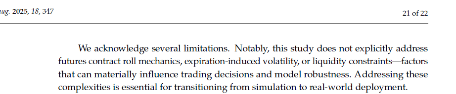

# BTP-1: Controlled Mathematical Model Comparison for Trading Strategy Optimization


## 1. Project Overview
Financial markets are characterized by low signal-to-noise ratios, high volatility, and non-stationary dynamics. Deep Reinforcement Learning (DRL) is theoretically well-suited for sequential trading decisions because it optimizes for cumulative future rewards rather than immediate prediction accuracy. However, standard DRL algorithms often fail in real-world deployment due to their inability to capture time-series momentum, their blindness to drawdown risk, and their tendency to generate high-turnover policies that succumb to transaction frictions. This BTP-1 project conducts a controlled empirical investigation to systematically evaluate the architectural and reward-design mechanisms required to stabilize a Proximal Policy Optimization (PPO) agent for daily equity trading. 

----
## 2. Literatures
- **Zou et al. (2023)** [link](https://arxiv.org/pdf/2212.02721)
    - Full Title: A Novel Deep Reinforcement Learning Based Automated Stock Trading System Using Cascaded LSTM Networks
    - Authors: Jie Zou, Jiashu Lou, Baohua Wang, Sixue Liu
    - Journal: Expert Systems With Applications

- **Huang et al. (2024)** [link](https://www.mdpi.com/2227-7390/12/24/4020)
    - Full Title: A Self-Rewarding Mechanism in Deep Reinforcement Learning for Trading Strategy Optimization
    - Authors: Yuling Huang, Chujin Zhou, Lin Zhang, Xiaoping Lu
    - Journal: Mathematics

- **Liu et al. / FinRL-Meta (2024)**
    - Full Title: Dynamic datasets and market environments for financial reinforcement learning
    - Authors: Xiao-Yang Liu, Ziyi Xia, Hongyang Yang, Jiechao Gao, Daochen Zha, Ming Zhu, Christina Dan Wang, Zhaoran Wang, Jian Guo
    - Journal: Machine Learning

- **Millea (2021)** [link](https://www.mdpi.com/2306-5729/6/11/119)
    - Full Title: Deep Reinforcement Learning for Trading—A Critical Survey 
    - Author: Adrian Millea
    - Journal: Data

- **Wang & Liu (2025)**
    - Full Title: ART-DRL: Adaptive Risk-Sensitive Deep Reinforcement Learning

---

## 3. Research Question
**Main Research Question:** How do temporal memory, dense risk-adjusted reward shaping, and turnover regularization independently and cumulatively affect the risk-adjusted out-of-sample performance of a PPO-based daily trading agent?

This translates into three specific, testable hypotheses:
*   **H1:** LSTM-based temporal memory improves out-of-sample trading robustness over a flat (memoryless) PPO baseline by capturing partial observability (POMDP).
*   **H2:** Replacing raw-return rewards with a Differential Sharpe Ratio (DSR) reward improves the agent’s risk-adjusted performance (higher Sharpe/Sortino, lower Max Drawdown) compared to purely profit-driven rewards.
*   **H3:** Adding explicit turnover regularization reduces excessive trading (churn) and transaction costs while maintaining or improving the risk-adjusted performance of the DSR-guided agent.

## 4. Research Gap

> 📸 **[Zou et al. 2023, p. 9, Tables 2 and 3](https://arxiv.org/pdf/2212.02721)**

*A Novel Deep Reinforcement Learning Based Automated Stock Trading System Using Cascaded LSTM Networks*


Existing DRL trading studies have explored several important mechanisms, but largely along separate methodological dimensions. **Zou et al. (2023)** demonstrate the benefit of LSTM-based temporal representation for PPO trading, establishing the value of historical sequence information. 

<div style="display: flex; justify-content: space-between; gap: 20px; align-items: flex-start;">
  
  
</div>

---

> 📸 **[Huang et al. 2024, p. 1 and p. 8](https://www.mdpi.com/2227-7390/12/24/4020)** 

*A Self-Rewarding Mechanism in Deep Reinforcement Learning for Trading Strategy Optimization*


**Huang et al. (2024)** investigate adaptive/self-rewarding mechanisms, showing that reward design can substantially affect trading performance and mitigate risk.

- Existing DRL trading systems mostly use static, manually designed reward functions, which do not adapt well to unstable and changing financial markets 

- The unresolved problem is how to build a **dynamic reward mechanism** that can adjust during learning and remain responsive to market changes 

- This paper addresses that gap by proposing a self-rewarding RL framework that combines expert labels with learned reward prediction 

<div style="display: flex; justify-content: space-between; gap: 20px; align-items: flex-start;">
  
  
</div>

<div style="text-align: center; margin-top: 15px;">
  
</div>

---


> 📸 **[Millea 2021, p. 21, Section 12.1](https://www.mdpi.com/2306-5729/6/11/119)**

*Deep Reinforcement Learning for Trading—A Critical Survey*

**Millea (2021)** highlights the insufficient treatment of realistic market frictions such as transaction costs, slippage, and spread in the majority of DRL research.


<div style="text-align: center; margin-top: 15px;">
  
</div>

---

> 📸 **[Liu et al. 2024, p. 3, 11, 27](https://link.springer.com/article/10.1007/s10994-023-06511-w)**

*Dynamic datasets and market environments for financial reinforcement learning*

Despite progress in financial reinforcement learning, existing studies still rely heavily on historical backtesting environments that may not represent real market conditions adequately. This creates a **simulation-to-reality** gap, where strong backtest results do not necessarily translate into robust live trading performance. The literature identifies several unresolved data-centric challenges, including **survivorship bias, low signal-to-noise ratio**, and **model overfitting**, which continue to limit the reliability and real-world deployment of FinRL agents  

<div style="display: flex; justify-content: space-between; gap: 20px; align-items: flex-start;">
  
  
</div>  

<div style="text-align: center; margin-top: 15px;">
  
</div>

----

> 📸 **[Wang & Liu (2025), Page 3 and Page 4, section 2.3](https://www.mdpi.com/1911-8074/18/7/347)** 

*Risk-Sensitive Deep Reinforcement Learning for Portfolio Optimization*

Finally, **Wang & Liu (2025)** demonstrate the benefits of adaptive risk-sensitive policies under changing market conditions. They highlight that prior deep reinforcement learning research has focused predominantly on equities and forex, leaving commodity futures underexplored. Specifically, previous commodity-based DRL studies were limited in adaptive agent-switching mechanisms or lacked portfolio-level optimization, failing to fully address the distinctive structural volatility and supply-shock complexity of petroleum futures. Furthermore, the authors identify a critical, practical gap for real-world deployment: even advanced proposed frameworks do not yet explicitly model futures contract roll mechanics, expiration-induced volatility, or liquidity constraints. 


 



---

However, **among the studies reviewed for this project, we did not find a controlled experimental framework that isolates these mechanisms incrementally within the same PPO trading environment**. In particular, the separate contributions of **(1) temporal memory, (2) dense risk-aware reward shaping, and (3) turnover regularization** are not systematically decomposed under identical data, cost assumptions, training conditions, and evaluation metrics.
                   
Taken together, these studies motivate a controlled investigation of how temporal memory, risk-aware reward design, and friction control interact within a common trading framework. Among the studies reviewed, we did not find a four-stage ablation that isolates these mechanisms under identical data, cost assumptions, training conditions, and evaluation metrics. This BTP-1 therefore proposes such a controlled comparison.
                             
Therefore, this BTP-1 proposes a controlled four-stage ablation:

$$
\boxed{
\text{PPO} \rightarrow \text{LSTM-PPO} \rightarrow \text{LSTM-PPO+DSR} \rightarrow \text{LSTM-PPO+DSR+Turnover}
}
$$

to empirically quantify the incremental effect of each mechanism on **return, risk-adjusted performance, drawdown, turnover, and cost-adjusted trading stability**.

## 5. Literature Review

| Paper | Main Idea | Dataset/Market | State | Action | Reward | Key Finding | Limitation Relevant to BTP-1 |
| :--- | :--- | :--- | :--- | :--- | :--- | :--- | :--- |
| **Millea (2021)** | Survey of DRL in trading & market mechanics. | Crypto / Stocks / FX | Various (OHLCV, LOB) | Discrete & Cont. | Sharpe, PnL, Sortino | Identifies major inconsistencies in data, friction, and evaluation. | Meta-analysis; highlights the need for strict ablation & friction-control. |
| **Zou et al. (2023)** | Cascaded LSTM-PPO for automated trading. | US, CN, IN, UK Stocks | 181-dim (Prices, MACD, RSI, etc.) | Discrete (Shares) | Net Return | LSTM feature extractor outperforms ensemble & flat methods (TW=30, HS=512). | Relies on absolute profit reward; blind to variance/drawdown risk. |
| **Liu et al. (2024)** | DataOps pipeline and dynamic walk-forward environments. | Dow 30, S&P 500, Crypto | Balances, Prices, Tech Indicators | Continuous (Weights) | Asset value change | RLOps standardizes environments, reducing simulation-to-reality gap. | Standard baselines lack advanced online risk-aware reward functions. |
| **Huang et al. (2024)** | Self-rewarding mechanism blending expert labels. | DJI, IXIC, SP500, HSI | OHLCV | Discrete | Sharpe, Min-Max | Self-rewarding significantly beats fixed formulaic rewards. | Replaces rather than regularizes reward; relies on predefined expert labels. |
| **Wang & Liu (2025)** | ART-DRL: Adaptive risk-sensitive DRL. | Equities | Market/Tech Features | Continuous | Adaptive Risk | Dynamically shifts risk sensitivity based on market regime. | *⚠ VERIFY ORIGINAL PDF BEFORE DEFENSE — source not available in current project files.* |

## 6. Common Trading Environment
To ensure strict comparability, all four models will be trained and evaluated in the exact same simulated environment:
*   **Data:** Daily OHLCV data for a defined universe of equities.
*   **Transaction Costs:** Fixed proportional commission fee.
*   **Slippage Assumptions:** Fixed slippage penalty applied per trade volume to simulate execution friction.
*   **Daily Rebalancing:** The agent acts once at the end of the daily close to adjust target holdings.
*   **Evaluation:** Dynamic walk-forward evaluation to prevent look-ahead bias and test temporal generalization.

**MDP / POMDP Formulation:**
Because financial markets are heavily influenced by unobservable latent factors, a standard MDP $(\mathcal{S}, \mathcal{A}, \mathcal{P}, \mathcal{R}, \gamma)$ is insufficient. The temporal information motivates a Partially Observable MDP (POMDP), formulated as $(\mathcal{O}, \mathcal{A}, \mathcal{P}, \mathcal{R}, \gamma)$, where the agent receives observations $o_t \in \mathcal{O}$ and utilizes an RNN (LSTM) to maintain a hidden belief state $h_t$ approximating the true market state.

## 7. State Representation
The observation vector $o_t$ provided to the agent strictly contains data available at decision time $t$ (no look-ahead bias). It is divided into:
1.  **Market Features:** Adjusted close prices and volumes (normalized).
2.  **Technical Indicators:** MACD, RSI, CCI, ADX.
3.  **Portfolio/Account Variables:** Current cash balance, current holdings (shares/weights), and total portfolio value.

## 8. Action Space
The action space $\mathcal{A}$ is a continuous vector $a_t \in [-1, 1]^N$ corresponding to the $N$ assets in the portfolio. 
*   **Definition:** Each scalar $a_{t,i}$ represents the target portfolio weight for asset $i$. 
*   **Constraint:** A Softmax or Dirichlet mapping will be applied post-network output to ensure $\sum_{i=1}^N w_{t,i} = 1$ and $w_{t,i} \ge 0$ (assuming a long-only constraint for equity basics).

## 9. Portfolio Dynamics and Cost Model
To prevent inconsistent gross-vs-net discrepancies and double-counting, the cost model is defined exactly once and applies to all four models.
*   **Total Portfolio Value ($V_t$):** $V_t = b_t + \sum_{i=1}^N h_{t,i} p_{t,i}$
*   **Transaction Cost ($C_t$):** Computed based on the change in weights: $C_t = c_{trans} \sum_{i=1}^N |w_{t,i} - w_{t-1,i}| \times V_t$
*   **Net Daily Return ($R_{net, t}$):** The true accounting return after all frictions:
    $$R_{net, t} = \frac{V_t - V_{t-1}}{V_{t-1}} - \frac{C_t}{V_{t-1}}$$
*   **Important:** $R_{net, t}$ represents the literal, measurable portfolio growth. It is the core input for all model reward functions.

## 10. Four-Model Ablation: Detailed Mathematical Modelling

### M1 — PPO Baseline
*   **Architecture:** Memoryless feed-forward Multi-Layer Perceptron (MLP) for both the actor $\pi_\theta(a_t|s_t)$ and critic $V_\phi(s_t)$ networks.
*   **State Input:** Only the current step observation $s_t$.
*   **Reward:** Direct net return, $r_t = R_{net, t}$ **(Liu et al. 2024, §3.1, p. 10)**.
*   **Objective:** Standard Generalized Advantage Estimation (GAE) where $\hat{A}_t = \delta_t + (\gamma \lambda) \delta_{t+1} + \dots$ and $\delta_t = r_t + \gamma V_\phi(s_{t+1}) - V_\phi(s_t)$. The actor is updated using the clipped surrogate objective:
    $$ L^{CLIP}(\theta) = \hat{\mathbb{E}}_t \left[ \min\left( \rho_t(\theta)\hat{A}_t, \text{clip}\left(\rho_t(\theta), 1-\epsilon, 1+\epsilon\right)\hat{A}_t \right) \right] $$

### M2 — LSTM-PPO (+ Temporal Memory)
*   **Mechanism Added:** Temporal memory (LSTM) to handle POMDP nature of financial data.
*   **Architecture:** Observation window $F_t = [s_{t-W+1}, \dots, s_t]$ is passed through an LSTM. The hidden state $h_t$ and cell state $c_t$ update recursively:
    $$ h_t, c_t = \text{LSTM}_{\text{cell}}(s_t, h_{t-1}, c_{t-1}) $$
*   **Conditioning:** The policy and value functions are now conditioned on the hidden representation: $\pi_\theta(a_t | h_t)$ and $V_\phi(h_t)$.
*   **Parameters:** Rather than arbitrary tuning, we strictly adopt the architecture validated by **Zou et al. (2023, §4.5.1 & §4.5.2, p. 9)**: Time Window ($W$) = 30, Hidden Size (HS) = 512.
*   **Reward:** Direct net return, $r_t = R_{net, t}$.

> 📸 **SCREENSHOT PLACEHOLDER 2 — [Zou et al. 2023, "A Novel DRL Based Automated Stock Trading System...", p. 9]**
> *   **Capture:** "Table 2: Comparison of different time windows in LSTM" and "Table 3: Comparison of different hidden sizes of LSTM in PPO", along with the short text stating TW=30 and HS=512 are the best parameters.
> *   **Purpose:** Justifies the direct adoption of the LSTM baseline variables without needing to re-tune from scratch.

### M3 — LSTM-PPO + DSR
*   **Mechanism Added:** Dense, risk-aware online reward. Standard profit rewards (M1 & M2) are blind to variance and drawdown risk. 
*   **Formulation:** Standard Sharpe requires a full episode to compute, causing sparse delayed rewards. Following **Millea (2021, §5.1.2, p. 8, Eq. 6 & 7)**, we use exponential moving estimates for the first moment ($A_t$) and second moment ($B_t$) of the net returns $R_{net, t}$:
    $$ A_t = A_{t-1} + \eta (R_{net, t} - A_{t-1}) $$
    $$ B_t = B_{t-1} + \eta (R_{net, t}^2 - B_{t-1}) $$
    Expanding the Sharpe ratio via a Taylor series yields the online DSR step-reward:
    $$ D_t = \frac{B_{t-1}\Delta A_t - \frac{1}{2}A_{t-1}\Delta B_t}{(B_{t-1} - A_{t-1}^2 + \varepsilon)^{3/2}} $$
*   **Parameters:** $\eta \in (0,1]$ is the DSR moving-average adaptation rate, strictly distinct from the PPO discount factor $\gamma$. $\varepsilon \approx 1e-8$ is added for numerical stability during low-volatility regimes.
*   **Reward:** $r_t = D_t$.

> 📸 **SCREENSHOT PLACEHOLDER 3 — [Millea 2021, "Deep Reinforcement Learning for Trading—A Critical Survey", p. 8, Section 5.1.2]**
> *   **Capture:** Equations 6 and 7 showing the $D_t$ formula and the moving average $A_t$ / $B_t$ updates.
> *   **Purpose:** Establishes the exact mathematical foundation for the M3 risk-aware reward mechanism.

### M4 — LSTM-PPO + DSR + Turnover Regularization
*   **Mechanism Added:** Action-friction control to regularize churn.
*   **Formulation:** DSR mathematically incentivizes the agent to capture tiny, high-Sharpe anomalies, leading to high-frequency action oscillation ("churn"). In live markets, slippage destroys these theoretical returns. To strictly isolate friction-control from risk-sensitivity (M3 → M4 comparison), the turnover penalty must be additive. 
    $$ r_t = D_t - \lambda_{turnover} \cdot \sum_{i=1}^N |a_{t,i} - a_{t-1,i}| $$
*   **Note:** This penalty $\lambda_{turnover}$ only punishes the RL *reward signal* to discourage churning. The actual portfolio simulation already accounts for true transaction costs in $R_{net, t}$. Comparing M3 to M4 will explicitly test the hypothesis that regularizing action outputs stabilizes the LSTM memory mechanism.

## 11. Controlled Experimental Design
To isolate the exact contribution of each mechanism, all models will be subjected to strict, identical constraints:
*   Identical daily datasets and feature sets.
*   Identical walk-forward folds (preventing varied market regimes from skewing results).
*   Identical cost and slippage assumptions.
*   Identical evaluation metrics.
*   Identical training budgets (timesteps) and identical Python `random.seed()` initializations.

**Ablation Logic:**
*   `M1 → M2` strictly isolates the value of the **temporal memory cell**.
*   `M2 → M3` strictly isolates the value of the **risk-aware reward shape** (DSR).
*   `M3 → M4` strictly isolates the value of **turnover regularization** on policy stabilization.

## 12. Walk-Forward Backtesting
Financial time series are severely non-stationary. A static train/test split leaks information and fails to test regime adaptability. We will utilize a strict walk-forward (rolling window) methodology:
1.  Train on window $T_0 \rightarrow T_k$.
2.  Validate (if tuning required) on $T_k \rightarrow T_{k+m}$.
3.  Test (Out-of-Sample) on $T_{k+m} \rightarrow T_{k+m+n}$.
4.  Roll the entire window forward by $n$ days and repeat.

> 📸 **SCREENSHOT PLACEHOLDER 4 — [Liu et al. 2024, "Dynamic datasets and market environments...", p. 13, Figure 5]**
> *   **Capture:** Figure 5: "A rolling window of training-testing-trading pipeline with dynamic dataset".
> *   **Purpose:** Provides literature grounding for the strict walk-forward methodology preventing look-ahead bias.

## 13. Evaluation Metrics
The final out-of-sample arrays will be concatenated and evaluated using standard quantitative finance metrics to properly assess H2 and H3:
*   **Cumulative Return (CR):** $CR = \frac{P_{end} - P_0}{P_0}$
*   **Annualized Return (AR)**
*   **Sharpe Ratio (SR):** $SR = \frac{\mathbb{E}[R_P] - R_f}{\sigma_P}$
*   **Sortino Ratio**
*   **Maximum Drawdown (MDD):** $MDD = \frac{\max(A_x - A_y)}{A_y}$
*   **Annualized Volatility**
*   **Average Turnover & Cumulative Transaction Cost** (Critical diagnostics to explicitly test the M4 hypothesis).

> 📸 **SCREENSHOT PLACEHOLDER 5 — [Huang et al. 2024, "A Self-Rewarding Mechanism...", p. 12, Section 4.2]**
> *   **Capture:** The paragraph defining Cumulative Return, Annualized Return, Sharpe Ratio, and Maximum Drawdown.
> *   **Purpose:** Academic justification of the standard financial evaluation metrics.

## 14. Experimental Matrix

**Ablation Focus Table:**
| Model | Architecture | Base Reward | Memory | Turnover Regularization | Main Question / Isolation |
| :--- | :--- | :--- | :--- | :--- | :--- |
| **M1** | Flat PPO (MLP) | Net Return | None | None | Baseline |
| **M2** | LSTM-PPO | Net Return | LSTM ($W=30$) | None | Does memory improve robustness? |
| **M3** | LSTM-PPO | DSR | LSTM ($W=30$) | None | Does DSR improve risk-adjusted metrics? |
| **M4** | LSTM-PPO | DSR | LSTM ($W=30$) | $\lambda \sum \Delta a_t$ | Does regularization solve churn/frictions? |

**Execution Table:**
| Dataset | Train Period | Test Period | Roll Window | Trans. Cost | Seeds | Metrics |
| :--- | :--- | :--- | :--- | :--- | :--- | :--- |
| [TODO: Ticker/Index] | [TODO] | [TODO] | [TODO: e.g. 1 yr] | 0.1% | 3 (e.g. 42, 100, 999) | CR, SR, MDD, Turnover |

## 15. Expected Analysis
The goal of this analysis is not simply "highest return wins."
*   If **H1** is true, M2 will show better adaptability across folds than M1, though potentially higher volatility.
*   If **H2** is true, M3 should report a higher Sharpe Ratio and lower MDD than M2, even if absolute Cumulative Return is lower.
*   If **H3** is true, M4 will exhibit significantly lower *Average Turnover* and *Cumulative Transaction Costs* than M3, resulting in higher net out-of-sample CR and SR compared to M3 (where M3's theoretical edge was destroyed by friction).
*   Fold-by-fold consistency will be analyzed to see if M4 survives high-volatility "crash" periods better than M1/M2.

## 16. Failure Analysis
We will proactively investigate and report failure modes. If a model fails, the analysis will diagnose:
*   **High Turnover / Churn:** Is the agent oscillating between $+1$ and $-1$ daily?
*   **Regime Sensitivity:** Did the model perform exceptionally in bull folds but collapse in bear folds?
*   **Reward Instability:** Did the DSR denominator collapse, causing NaNs or exploding gradients?
*   **Seed Sensitivity:** Did the model converge on seed 42 but fail completely on seed 100?

*Note: These specific failures will form the exact evidence-based motivation for BTP-2.*

## 17. Reproducibility
To ensure any student or researcher can independently reproduce this ablation:
*   **Python/Library versions:** Documented via `requirements.txt` (e.g., Stable-Baselines3, PyTorch).
*   **Random Seeds:** Pytorch, Numpy, and Gym environment seeds strictly locked.
*   **Checkpoints:** Model weights saved at every roll-forward fold.
*   **Logging:** TensorBoard used to log actor/critic loss, entropy, and step-rewards.
*   **Configuration:** YAML or JSON configs storing all hyperparameters ($W, \eta, \lambda, \gamma, \varepsilon$).

## 18. Project Directory Structure
```text
BTP1_RL/
├── data/               # Raw OHLCV data and preprocessing scripts
├── configs/            # YAML files containing hyperparams for M1, M2, M3, M4
├── env/                # Gym environment definitions (Base, Cost Logic)
├── models/             # Custom PPO and LSTM policy extractors
├── rewards/            # Net Return, DSR, and Regularization functions
├── training/           # Walk-forward loops and SB3 runners
├── backtesting/        # Out-of-sample inference scripts
├── evaluation/         # CR, SR, MDD, Turnover calculators & plotting
├── experiments/        # Execution scripts (run_m1.py, run_m2.py...)
├── results/            # Saved checkpoints, Tensorboard logs, CSV metrics
├── notebooks/          # EDA, feature engineering, and visualization
└── docs/               # Screenshots, PDFs, and thesis documents
```

## 19. Implementation Roadmap
Models will be built progressively, validating each step before moving to the next:
1. Dataset acquisition & cleaning (Handle NaNs, corporate actions).
2. Feature engineering (MACD, RSI, etc.).
3. Trading environment build (State representation, Gym API).
4. Cost model integration (Net Return logic).
5. **M1**: Implement and validate Flat PPO baseline.
6. Run M1 baseline backtest to confirm environment mechanics.
7. **M2**: Integrate LSTM policy network; test temporal convergence.
8. **M3**: Implement online DSR reward; handle numerical stability ($\varepsilon$).
9. **M4**: Add additive turnover regularization ($\lambda$).
10. Execute fully automated walk-forward loops for M1-M4.
11. Re-run experiments across multiple random seeds.
12. Generate evaluation tables, equity curves, and turnover diagnostics.
13. Compile final BTP-1 report and failure analysis.

## 20. Research Log / Experiment Tracking
*Every experiment run will be logged using this template in the `docs/` folder:*
*   **Experiment ID:**
*   **Hypothesis Tested:**
*   **Model Config:**
*   **Dataset/Window:**
*   **Hyperparameters:**
*   **Seed:**
*   **Metrics Output (CR/SR/MDD/Turnover):**
*   **Interpretation:**
*   **Failure Diagnostics:**
*   **Next Iteration Trigger:**

## 21. Literature Citation & Screenshot Protocol
Every literature-derived mechanism in this codebase is strictly traced to the verified uploads in the project repository.
*   **[1]** Millea, “Deep Reinforcement Learning for Trading—A Critical Survey,” *Data* 2021, §12.1, p. 21. (Friction Gap).
*   **[2]** Zou et al., “A Novel Deep Reinforcement Learning Based Automated Stock Trading System...”, *Expert Systems With Applications* 2023, §4.5.1-4.5.2, p. 9. (LSTM Parameters).
*   **[3]** Millea, “Deep Reinforcement Learning for Trading—A Critical Survey,” *Data* 2021, §5.1.2, p. 8. (DSR Mathematics).
*   **[4]** Liu et al., “Dynamic datasets and market environments...”, *Machine Learning* 2024, §3.1, p. 10. (Net Return & Base MDP).
*   **[5]** Liu et al., “Dynamic datasets and market environments...”, *Machine Learning* 2024, §3.3.2, p. 13. (Walk-forward / Rolling window).
*   **[6]** Huang et al., “A Self-Rewarding Mechanism in Deep Reinforcement Learning...”, *Mathematics* 2024, §4.2, p. 12. (Evaluation Metrics).
*   **[7]** Wang & Liu, "ART-DRL..." 2025. *⚠ VERIFY ORIGINAL PDF BEFORE DEFENSE — source not available in current project files.*

*(Refer to inline 📸 SCREENSHOT placeholders throughout the README for visual evidence positioning).*

## 22. BTP-2 / MTP Future Direction
The BTP-2 research direction is intentionally withheld from this implementation and will be dynamically driven by the **Failure Analysis (Section 15)** of the M4 agent. If M4 successfully controls churn but fails to adapt its risk preference during sudden market crashes, BTP-2 will explore **Regime-Aware or Adaptive DRL** (e.g., dynamically modulating the DSR adaptation rate $\eta$ or risk penalty based on macro-market states). Extensions into multi-agent systems or self-rewarding logic will be reserved for MTP stages.

## 23. Final Summary
This project establishes a completely controlled, empirical reinforcement learning ablation study. It begins with a **PPO baseline**, adds **temporal memory** to capture market states, applies a **risk-aware reward** to penalize drawdown, and finally introduces **friction control** to ensure the policy survives real-world transaction costs. By strictly maintaining identical datasets, constraints, and walk-forward evaluations, the research will isolate the exact mathematical contribution of each mechanism, map the definitive failure modes of the strongest configuration, and lay a mathematically proven foundation for adaptive regime-switching algorithms in BTP-2.
