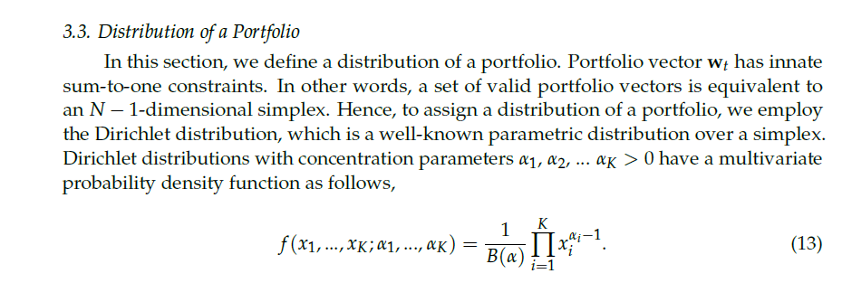
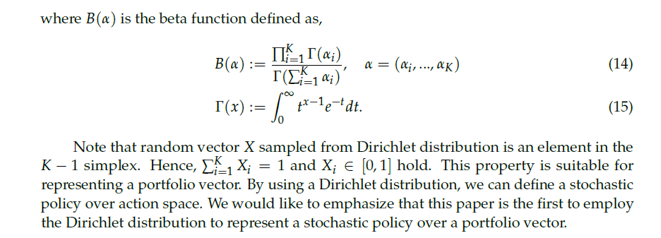
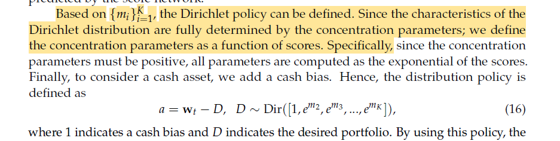

# Risk-Aware Deep Reinforcement Learning for Daily Stock Trading 
### *A Controlled Ablation of Temporal Memory, Reward Shaping, and Turnover Regularization*

  
## 1. Project Overview
Financial markets are characterized by low signal-to-noise ratios, high volatility, and non-stationary dynamics. Deep Reinforcement Learning (DRL) is theoretically well-suited for sequential trading decisions because it optimizes for cumulative future rewards rather than immediate prediction accuracy. However, standard DRL algorithms often fail in real-world deployment due to their inability to capture time-series momentum, their blindness to drawdown risk, and their tendency to generate high-turnover policies that succumb to transaction frictions. This BTP-1 project conducts a controlled empirical investigation to systematically evaluate the architectural and reward-design mechanisms required to stabilize a Proximal Policy Optimization (PPO) agent for daily equity trading. 

----
## 2. Literatures
- **Zou et al. (2023)** [link](https://arxiv.org/pdf/2212.02721)
    - Full Title: A Novel Deep Reinforcement Learning Based Automated Stock Trading System Using Cascaded LSTM Networks
    - Authors: Jie Zou, Jiashu Lou, Baohua Wang, Sixue Liu
    - Journal: Expert Systems With Applications

- **Huang et al. (2024)** [link](https://www.mdpi.com/2227-7390/12/24/4020)
    - Full Title: A Self-Rewarding Mechanism in Deep Reinforcement Learning for Trading Strategy Optimization
    - Authors: Yuling Huang, Chujin Zhou, Lin Zhang, Xiaoping Lu
    - Journal: Mathematics

- **Liu et al. / FinRL-Meta (2024)** [link](https://link.springer.com/article/10.1007/s10994-023-06511-w)
    - Full Title: Dynamic datasets and market environments for financial reinforcement learning
    - Authors: Xiao-Yang Liu, Ziyi Xia, Hongyang Yang, Jiechao Gao, Daochen Zha, Ming Zhu, Christina Dan Wang, Zhaoran Wang, Jian Guo
    - Journal: Machine Learning

- **Millea (2021)** [link](https://www.mdpi.com/2306-5729/6/11/119)
    - Full Title: Deep Reinforcement Learning for Trading—A Critical Survey 
    - Author: Adrian Millea
    - Journal: Data

- **Wang & Liu (2025)** [link](https://www.mdpi.com/1911-8074/18/7/347)
    - Full Title: ART-DRL: Adaptive Risk-Sensitive Deep Reinforcement Learning

---

## 3. Research Question
**Main Research Question:** How do temporal memory, dense risk-adjusted reward shaping, and turnover regularization independently and cumulatively affect the risk-adjusted out-of-sample performance of a **PPO-based** daily trading agent?

This translates into three specific, testable hypotheses:
*   **H1:** LSTM-based temporal memory improves out-of-sample trading robustness over a flat (memoryless) PPO baseline by capturing partial observability (POMDP).
*   **H2:** Replacing raw-return rewards with a **Differential Sharpe Ratio (DSR)** reward improves the agent’s **risk-adjusted** performance **(higher Sharpe/Sortino, lower Max Drawdown)** compared to purely profit-driven rewards.
*   **H3:** Adding explicit turnover regularization reduces excessive trading (churn) and transaction costs while maintaining or improving the risk-adjusted performance of the DSR-guided agent.

## 4. Research Gap

>  **[Zou et al. 2023, p. 9, Tables 2 and 3](https://arxiv.org/pdf/2212.02721)**

*A Novel Deep Reinforcement Learning Based Automated Stock Trading System Using Cascaded LSTM Networks*

Although deep reinforcement learning has shown promise for automated stock trading, existing approaches remain constrained by the noisy, unstable, and highly dynamic nature of financial market data. Prior machine learning models are also prone to overfitting, which reduces their generalization ability in real trading environments. In addition, reinforcement learning methods originally developed for gaming are not directly adaptable to financial data with low signal-to-noise ratios and uneven market behavior, which leads to performance limitations. Even in the proposed cascaded LSTM-PPO framework, further improvement still depends on unresolved issues such as the need for larger training datasets and more effective reward functions to improve stability and control pullback risk. Therefore, a clear research gap remains in developing more robust deep reinforcement learning trading systems that can better handle noisy financial data, generalize reliably, and achieve improved risk-adjusted performance 

  

 

           
       

   

---

>  **[Huang et al. 2024, p. 1 and p. 8](https://www.mdpi.com/2227-7390/12/24/4020)** 

*A Self-Rewarding Mechanism in Deep Reinforcement Learning for Trading Strategy Optimization*

**Huang et al. (2024)** investigate adaptive/self-rewarding mechanisms, showing that reward design can substantially affect trading performance and mitigate risk.

- Existing DRL trading systems mostly use static, manually designed reward functions, which do not adapt well to unstable and changing financial markets 

- The unresolved problem is how to build a **dynamic reward mechanism** that can adjust during learning and remain responsive to market changes 

- This paper addresses that gap by proposing a self-rewarding RL framework that combines expert labels with learned reward prediction 
         

           
       

 

  

   

---

>  **[Millea 2021, p. 21, Section 12.1](https://www.mdpi.com/2306-5729/6/11/119)**

*Deep Reinforcement Learning for Trading—A Critical Survey*
                
Despite increasing interest in deep reinforcement learning for financial trading, the literature remains methodologically inconsistent and difficult to compare across studies. Existing works frequently use different datasets, different time periods, and different preprocessing techniques, which makes it difficult to determine whether reported performance differences are caused by the learning algorithm itself or by variation in the input data. In addition, only a limited number of studies examine model performance across multiple market types, leaving the generalizability of DRL-based trading systems insufficiently understood. Reproducibility is further weakened by the limited availability of source code and the incomplete reporting of implementation details such as hyperparameters and network architecture. Therefore, an important research gap remains in developing more standardized, comparable, and reproducible evaluation practices for DRL-based trading research
         

  

   

  

  

---

>  **[Liu et al. 2024, p. 3, 11, 27](https://link.springer.com/article/10.1007/s10994-023-06511-w)**

*Dynamic datasets and market environments for financial reinforcement learning*

Despite progress in financial reinforcement learning, existing studies still rely heavily on historical backtesting environments that may not represent real market conditions adequately. This creates a **simulation-to-reality** gap, where strong backtest results do not necessarily translate into robust live trading performance. The literature identifies several unresolved data-centric challenges, including **survivorship bias, low signal-to-noise ratio**, and **model overfitting**, which continue to limit the reliability and real-world deployment of FinRL agents  

  
  

  

  

----

>  **[Wang & Liu (2025), Page 3 and Page 4, section 2.3](https://www.mdpi.com/1911-8074/18/7/347)** 

*Risk-Sensitive Deep Reinforcement Learning for Portfolio Optimization*

- Finally, **Wang & Liu (2025)** demonstrate the benefits of adaptive risk-sensitive policies under changing market conditions. They highlight that prior deep reinforcement learning research has focused predominantly on **equities and forex**, leaving commodity futures underexplored. Specifically, previous commodity-based DRL studies were limited in **adaptive agent-switching mechanisms or lacked portfolio-level optimization**, failing to fully address the distinctive structural volatility and supply-shock complexity of petroleum futures. 
- The paper also identifies a second, more practical gap: even its own proposed framework does not yet explicitly model roll mechanics, expiration effects, or liquidity constraints, which limits real-world deployment. 

       
         

  

          
              

    

          

---

### Combined Research Gap

Taken together, the reviewed studies address important but largely **separate aspects** of DRL-based financial trading:

- **Zou et al. (2023)** demonstrate the benefit of **LSTM-based temporal memory** for PPO trading by using historical sequences to capture temporal information. However, their framework mainly relies on **return-based rewards**, which do not directly account for risk measures such as variance or drawdown. 

- **Huang et al. (2024)** address the limitation of **static reward functions** by introducing a self-rewarding mechanism that combines expert labels with learned reward prediction. This shows the importance of reward design, but the approach **replaces the reward mechanism** rather than isolating the effect of a mathematically defined risk-adjusted reward such as the Differential Sharpe Ratio (DSR).

- **Millea (2021)** highlights the problem of **inconsistent experimental settings** in DRL trading research, where studies often use different datasets, time periods, preprocessing methods, friction assumptions, and evaluation procedures. This makes it difficult to determine whether performance improvements come from the algorithm or from differences in the experimental setup.

- **Liu et al. (2024)** address the need for more realistic and reproducible financial RL experiments through **dynamic datasets, realistic market environments, and rolling training-testing-trading evaluation**. However, their main contribution is focused on the **environment and evaluation pipeline**, rather than isolating the contribution of advanced risk-aware reward mechanisms.

- **Wang & Liu (2025)** demonstrate **adaptive risk-sensitive decision-making** under changing market conditions. However, their framework does not separately isolate the contributions of **temporal memory, reward shaping, and turnover control** within a single controlled ablation.

### Overall Gap

These studies therefore motivate three important directions:

**(1) temporal memory, (2) risk-aware reward design, and (3) turnover regularization.**

However, **among the studies reviewed for this project, we did not find a controlled experimental framework that isolates these mechanisms incrementally within the same PPO trading environment**. In particular, their separate contributions are not systematically decomposed under **identical data, cost assumptions, training conditions, and evaluation metrics**.

Therefore, this BTP-1 proposes a controlled four-stage ablation:

  
  
    PPO → LSTM-PPO → LSTM-PPO + DSR → LSTM-PPO + DSR + Turnover
  

to empirically quantify the incremental effect of each mechanism on **return, risk-adjusted performance, drawdown, turnover, and cost-adjusted trading stability**.

## 5. Literature Review

| Paper | Main Idea | Dataset/Market | State | Action | Reward | Key Finding | Limitation Relevant to BTP-1 |
| :--- | :--- | :--- | :--- | :--- | :--- | :--- | :--- |
| **Millea (2021)** | Survey of DRL in trading & market mechanics. | Crypto / Stocks / FX | Various (OHLCV, LOB) | Discrete & Cont. | Sharpe, PnL, Sortino | Identifies major inconsistencies in data, friction, and evaluation. | Meta-analysis; highlights the need for strict ablation & friction-control. |
| **Zou et al. (2023)** | Cascaded LSTM-PPO for automated trading. | US, CN, IN, UK Stocks | 181-dim (Prices, MACD, RSI, etc.) | Discrete (Shares) | Net Return | LSTM feature extractor outperforms ensemble & flat methods (TW=30, HS=512). | Relies on absolute profit reward; blind to variance/drawdown risk. |
| **Liu et al. (2024)** | DataOps pipeline and dynamic walk-forward environments. | Dow 30, S&P 500, Crypto | Balances, Prices, Tech Indicators | Continuous (Weights) | Asset value change | RLOps standardizes environments, reducing simulation-to-reality gap. | Standard baselines lack advanced online risk-aware reward functions. |
| **Huang et al. (2024)** | Self-rewarding mechanism blending expert labels. | DJI, IXIC, SP500, HSI | OHLCV | Discrete | Sharpe, Min-Max | Self-rewarding significantly beats fixed formulaic rewards. | Replaces rather than regularizes reward; relies on predefined expert labels. |
| **Wang & Liu (2025)** | ART-DRL: Adaptive risk-sensitive DRL. | Equities | Market/Tech Features | Continuous | Adaptive Risk | Dynamically shifts risk sensitivity based on market regime. | Focuses on adaptive risk sensitivity but does not isolate the independent contribution of temporal memory versus reward shaping in a controlled ablation. |

## 6. Common Trading Environment

To ensure strict comparability, all four models will be trained and evaluated in the same simulated trading environment.

- **Data:** Daily OHLCV data for a fixed universe of \(N\) equities.
- **Decision Frequency:** One portfolio-rebalancing decision is made per trading day.
- **Transaction Costs:** A fixed pro
- **Data:** Daily OHLCV data for a fixed universe of $N$ equities.
- **Decision Frequency:** One portfolio-rebalancing decision is made per trading day.
- **Transaction Costs:** A fixed proportional transaction-cost rate $c_{\mathrm{trans}}$ is applied to traded portfolio value.
- **Slippage:** A fixed proportional slippage assumption may be incorporated into the effective transaction-cost rate.
- **Portfolio Constraint:** Long-only allocation across $N$ stocks and an explicit cash component.
- **Evaluation:** Strict walk-forward training, validation (where required), and out-of-sample testing.

### POMDP Formulation

The daily trading problem is formulated as a Partially Observable Markov Decision Process (POMDP). The agent cannot observe all latent factors governing financial markets and therefore receives only a partial observation of the underlying environment.

We define the POMDP as:

$$
\mathcal{P}=(\mathcal{S},\mathcal{A},\mathcal{T},\mathcal{R},\Omega,\gamma)
$$

where:

- ${S}$: is the underlying environment state space,
- $\mathcal{A}$ is the action space,
- $\mathcal{T}$ represents the environment transition dynamics,
- $\mathcal{R}$ is the reward function,
- $\Omega$ is the observation space,
- $\gamma\in(0,1]$ is the PPO discount factor.

At time $t$, the agent receives an observation $s_t\in\Omega$ containing only information available up to the current decision time. For M1, the policy operates directly on $s_t$. For M2--M4, a sequence of observations is provided to an LSTM to construct a temporal representation $h_t$.

**MDP / POMDP Formulation:**
Because financial markets are heavily influenced by unobservable latent factors, a standard MDP $(\mathcal{S}, \mathcal{A}, \mathcal{P}, \mathcal{R}, \gamma)$ is insufficient. The temporal information motivates a Partially Observable MDP (POMDP), formulated as $(\mathcal{O}, \mathcal{A}, \mathcal{P}, \mathcal{R}, \gamma)$, where the agent receives observations $o_t \in \mathcal{O}$ and utilizes an RNN (LSTM) to maintain a hidden belief state $h_t$ approximating the true market state.

## 7. State / Observation Representation

The observation provided to the agent contains only information available at decision time $t$, with all feature transformations computed causally to avoid look-ahead bias.

For each asset $i\in\{1,\ldots,N\}$, define the per-asset feature vector:

$$
f_{i,t}\in\mathbb{R}^{F}
$$

where $F$ is the number of features per asset.  

For each asset $(i\in\{1,\ldots,N\})$, define the per-asset feature vector:

$$
f_{i,t}=
\begin{bmatrix} 
 r_{i,t} ,  \frac{O_{i,t}}{C_{i,t}}-1 , \frac{H_{i,t}}{C_{i,t}}-1 , \frac{L_{i,t}}{C_{i,t}}-1 , \tilde v_{i,t} , \frac{RSI_{i,t}}{50}-1 & MACD_{i,t} , \frac{EMA^{fast}_{i,t}}{C_{i,t}}-1 , \frac{EMA^{slow}_{i,t}}{C_{i,t}}-1 , \%B_{i,t} , BW_{i,t} , \frac{CCI_{i,t}}{100} , \frac{ADX_{i,t}}{100}
\end{bmatrix}^{\top}
\in\mathbb{R}^{13}
$$

where $(r_{i,t})$ is the log return, $(\tilde v_{i,t})$ is the causally normalized volume, and the remaining terms represent price-relative and technical-indicator information.

The feature vector contains normalized return, price-relative, volume, and technical-indicator information, including:

- log return,
- OHLC price-relative features,
- normalized volume,
- RSI,
- MACD,
- EMA-relative features,
- Bollinger $\%B$ and bandwidth,
- CCI,
- ADX.

Raw price levels and raw portfolio/account dollar values are not directly provided to the agent.

The market-feature vector is obtained by concatenating the feature vectors of all \(N\) assets:

$$x_t = concat\left(f_{1,t},f_{2,t},\ldots,f_{N,t}\right)\in\mathbb{R}^{13N}$$

The complete observation additionally includes the current portfolio weights:

$$
s_t=
\left[
x_t;
w_t^{cur}
\right]
\in
\mathbb{R}^{13N+N+1}.
$$

The portfolio state is represented by the current portfolio-weight vector:

$$w_t^{cur} = \left[w_{1,t}^{cur},\ldots,w_{N,t}^{cur}, w_{cash,t}^{cur}\right]\in\mathbb{R}^{N+1},$$

subject to:

$$
w_{i,t}^{cur}\geq0,
\qquad
w_{cash,t}^{cur}\geq0,
$$

$$
\sum_{i=1}^{N}w_{i,t}^{cur}
+w_{cash,t}^{cur}=1.
$$

The complete observation is therefore:

$$
\boxed{
s_t=[x_t;w_t^{cur}]
}
$$

with dimension:

$$
s_t\in\mathbb{R}^{NF+N+1}.
$$

Here:

- $N$ = number of stocks in the trading universe,
- $F$ = number of features per stock,
- $f_{i,t}$ = feature vector of asset $i$ at time $t$,
- $x_t$ = concatenated market-feature vector,
- $w_t^{cur}$ = current portfolio weights including cash,
- $s_t$ = complete observation available to the RL agent.

### Temporal Representation

For M1, only the current observation $s_t$ is provided to the policy.

For M2--M4, a historical observation window of length $W$ is constructed:

$$F_t = [s_{t-W+1},\ldots,s_{t-1},s_t]$$

where:

$$F_t\in\mathbb{R}^{W\times(NF+N+1)}.$$

The sequence $F_t$ is processed by an LSTM to produce the hidden representation:

$$(h_t,c_t) = \text{LSTM}(F_t),$$

where $h_t\in\mathbb{R}^{H}$ is the hidden representation and $c_t\in\mathbb{R}^{H}$ is the LSTM cell state. $H$ denotes the LSTM hidden size.

For the initial BTP-1 configuration:

$$
W=30,\qquad H=512.
$$

The LSTM provides a learned temporal representation of the historical observations; it does not explicitly predict future prices.

## 8. Action Space
The action space $\mathcal{A}$ must ensure that portfolio weights are non-negative and sum to 1. Rather than predicting unbounded values and applying a post-hoc Softmax, we directly ground our continuous action space in the Dirichlet distribution formulation presented by **Yang et al. (2022)**.

*   **Reference:** *Yang, H., Park, H., & Lee, K. (2022), "A Selective Portfolio Management Algorithm with Off-Policy Reinforcement Learning Using Dirichlet Distribution"*

The action $a_t$ is defined exactly as the target portfolio weights:

$$a_t \equiv w_t^{target}$$

where $w_{i,t}^{target} \ge 0$ and $\sum_{i=1}^N w_{i,t}^{target} + w_{cash,t}^{target} = 1$.

**Dirichlet Parameterization:**
Following Yang et al., the policy network outputs the concentration parameters $\alpha_t$ of a Dirichlet distribution. To ensure $\alpha_t > 0$, we use an exponential mapping from the network's output logits $m_t$:

$$m_t = W_a h_t + b_a$$
$$\alpha_{i,t} = \exp(m_{i,t})$$

The target weights are then sampled from the resulting Dirichlet distribution:

$$w_t^{target} \sim \text{Dirichlet}(\alpha_t)$$

### Addressing the Dirichlet Sparsity Limitation (Weight Thresholding)

A mathematical limitation of the standard Dirichlet distribution is that its support lies on the open simplex $(0, 1)$. It mathematically cannot output an exact $0$. In practical portfolio management, sparsity is critical: an agent must be able to hold $0\%$ of an underperforming stock to avoid continuous, microscopic rebalancing (e.g., adjusting a weight from $0.002$ to $0.001$) that bleeds capital through transaction fees.To enforce sparsity, prevent micro-churn, and make the continuous action space viable for real-world transaction costs, we apply a deterministic thresholding mask to the sampled weights before passing them to the portfolio environment.

1. Thresholding:Apply a minimum allocation boundary $\tau$ (e.g., $\tau = 0.01$ or $1\%$). If a generated weight falls below this threshold, it is forced to zero:$$\tilde{w}_{i,t}^{target} = \begin{cases} 0, & \text{if } w_{i,t}^{target} < \tau \\ w_{i,t}^{target}, & \text{otherwise} \end{cases}$$

2. Renormalization:Re-normalize the remaining active weights to ensure the portfolio constraint $\sum w_i = 1$ is maintained:$$w_{i,t}^{final} = \frac{\tilde{w}_{i,t}^{target}}{\sum_{j} \tilde{w}_{j,t}^{target}}$$The environment and transaction cost models will execute the portfolio rebalancing based exclusively on $w_t^{final}$. This mathematically bridges the gap between the continuous, strictly positive probability density of the Dirichlet actor and the sparse allocation reality of financial markets.

The expected weight for each asset is naturally defined by the properties of the Dirichlet distribution:

$$\mathbb{E}[w_{i,t}^{target}] = \frac{\alpha_{i,t}}{\sum_j \alpha_{j,t}}$$

Here:

- $a_t$ = RL action at time $t$,
- $w_t^{target}$ = target portfolio weights selected by the agent,
- $w_{i,t}^{target}$ = target weight of stock $i$,
- $w_{cash,t}^{target}$ = target cash weight,
- $\alpha_t$ = Dirichlet concentration-parameter vector,
- $m_t$ = unconstrained actor output,
- $W_a,b_a$ = parameters of the actor's final layer,
- $h_t$ = LSTM hidden representation for M2--M4.

The Dirichlet formulation is motivated by Yang et al. (2022), who use the Dirichlet distribution to model portfolio allocations on the simplex. Their formulation is adapted here to the on-policy PPO setting used in BTP-1.

>  **[Yang et al. 2022](https://www.mdpi.com/2075-1680/11/12/664), Section 3.3, Equations 13-16**

*A Selective Portfolio Management Algorithm with Off-Policy Reinforcement Learning Using Dirichlet Distribution*

    

  

    

 

    

 

> *   **Purpose:** Establishes the literature-grounded mathematical mechanism for learning valid, continuous portfolio weights via Dirichlet concentration parameters. (Note: While Yang et al. apply this in an off-policy framework, we adopt the continuous action-space parameterization for our on-policy PPO).

## 9. Portfolio Dynamics and Cost Model

The portfolio environment converts the target allocation generated by the agent into actual portfolio rebalancing, applies transaction costs, and updates portfolio wealth.

### 9.1 Current and Target Portfolio Weights

The current portfolio before rebalancing is:

$$w_t^{cur} = [w_{1,t}^{cur},\ldots,w_{N,t}^{cur},w_{cash,t}^{cur}]$$

The agent selects:
  
$$w_t^{target} = [w_{1,t}^{target},\ldots,w_{N,t}^{target},w_{cash,t}^{target}]$$

For each traded stock, the change in allocation is:

 $\Delta w_{i,t} = w_{i,t}^{target} - w_{i,t}^{cur}$

Here:

- $\Delta w_{i,t}$ > 0 indicates an increase in allocation,
- $\Delta w_{i,t}$ < 0 indicates a decrease in allocation,
- $\Delta w_{i,t}$ = 0 indicates no change.

### 9.2 Transaction Cost

Transaction cost is modeled as proportional to the absolute amount reallocated:

 $C_t = c_{trans} V_{t-1} \sum_{i=1}^N |\Delta w_{i,t}| $

where:

- Ct = monetary transaction cost at time t,
- ctrans = proportional transaction-cost rate,
- Vt-1 = portfolio value immediately before rebalancing,
- $\Delta w_{i,t}$ = change in stock i's portfolio weight.

The cash component is not separately charged; cash is the residual portfolio allocation after stock rebalancing.

### 9.3 Portfolio Wealth Evolution

After paying transaction costs, the portfolio evolves according to the target stock allocation and realized stock returns:

$$V_t = (V_{t-1}-C_t)\left[\sum_{i=1}^{N}w_{i,t}^{target}(1+R_{i,t}) + w_{cash,t}^{target}\right]$$

Here:

- $V_t$ = portfolio value at the end of period $t$,
- $R_{i,t}$ = realized return of stock $i$ over period $t$,
- $w_{i,t}^{target}$ = target weight allocated to stock $i$,
- $w_{cash,t}^{target}$ = target cash allocation.

The cash component is assumed to have zero return over the daily holding period for BTP-1; therefore, no risk-free-rate term is included in the portfolio wealth equation.

### 9.4 Net Portfolio Return

The realized net portfolio return is:

$$R_{net,t} = \frac{V_t-V_{t-1}}{V_{t-1}}$$

Because transaction costs are already deducted when computing $V_t$, they are not subtracted again from $R_{net,t}$.

Thus, $R_{net,t}$ is the single accounting measure of realized portfolio growth after modeled trading frictions and is used as the direct reward for M1 and M2 and as the return input to the DSR calculation for M3 and M4.

## 10. Four-Model Ablation: Detailed Mathematical Modelling

### M1 — PPO Baseline
*   **Architecture:** Memoryless feed-forward Multi-Layer Perceptron (MLP) for both the actor $\pi_\theta(a_t|s_t)$ and critic $V_\phi(s_t)$ networks.
*   **State Input:** Only the instantaneous current step observation $s_t$.
*   **Reward:** Direct net return, $r_t = R_{net, t}$ **(Liu et al. 2024, §3.1, p. 10)**.
*   **Objective:** Standard Generalized Advantage Estimation (GAE) where $\hat{A}_t = \delta_t + (\gamma\lambda)\delta_{t+1} + \dots$ and $\delta_t = r_t + \gamma V_\phi(s_{t+1}) - V_\phi(s_t)$. The actor is updated using the clipped surrogate objective:

    $$L^{CLIP}(\theta) = \hat{\mathbb{E}}_t \left[ \min\left( \rho_t(\theta)\hat{A}_t, \text{clip}\left(\rho_t(\theta), 1-\epsilon, 1+\epsilon\right)\hat{A}_t \right) \right]$$

### M2 — LSTM-PPO (+ Temporal Memory)
*   **Mechanism Added:** Temporal memory (LSTM) to handle POMDP nature of financial data.
*   **Architecture:** Observation window $F_t = [s_{t-W+1}, \dots, s_t]$ is passed through an LSTM. The hidden state $h_t$ and cell state $c_t$ update recursively:

    $$h_t, c_t = LSTM_{cell}(s_t, h_{t-1}, c_{t-1})$$
       
*   **Conditioning:** The policy and value functions are now conditioned on the hidden representation: $\pi_\theta(a_t | h_t)$ and $V_\phi(h_t)$. Note that the LSTM does not explicitly predict future prices; it forms a learned temporal representation $h_t$.
*   **Parameters:** Rather than arbitrary tuning, we strictly adopt the architecture validated by **Zou et al. (2023, §4.5.1 & §4.5.2, p. 9)**: Time Window ($W$) = 30, Hidden Size (HS) = 512.
*   **Reward:** Direct net return, $r_t = R_{net, t}$.

>  **[Zou et al. 2023](https://arxiv.org/pdf/2212.02721), "A Novel DRL Based Automated Stock Trading System...", p. 9**

  
  

    

> *   **Purpose:** Justifies the direct adoption of the LSTM baseline variables without needing to re-tune from scratch.

### M3 — LSTM-PPO + DSR
*   **Mechanism Added:** Dense, risk-aware online reward. Standard profit rewards (M1 & M2) are blind to variance and drawdown risk. 
*   **Formulation:** Standard Sharpe requires a full episode to compute, causing sparse delayed rewards. Following **Millea (2021, §5.1.2, p. 8, Eq. 6 & 7)**, we use exponential moving estimates for the first moment ($A_t$) and second moment ($B_t$) of the net returns $R_{net, t}$:

    $$A_t = A_{t-1} + \eta (R_{net, t} - A_{t-1})$$

    $$B_t = B_{t-1} + \eta (R_{net, t}^2 - B_{t-1})$$

    Expanding the Sharpe ratio via a Taylor series yields the online DSR step-reward:

    $$D_t = \frac{B_{t-1}\Delta A_t - \frac{1}{2}A_{t-1}\Delta B_t}{(B_{t-1} - A_{t-1}^2 + \varepsilon)^{3/2}}$$
*   **Parameters:** $\eta \in (0,1]$ is the DSR moving-average adaptation rate, strictly distinct from the PPO discount factor $\gamma$. 
    **$\varepsilon$:** A small numerical-stability constant (e.g., $10^{-8}$) added to the DSR denominator to prevent instability when the estimated variance approaches zero.
*   **Reward:** $r_t = D_t$.

>  **[Millea 2021](https://www.mdpi.com/2306-5729/6/11/119), "Deep Reinforcement Learning for Trading—A Critical Survey", p. 8, Section 5.1.2**

  
  

    
               
> *   **Purpose:** Establishes the exact mathematical foundation for the M3 risk-aware reward mechanism.
           
### M4 — LSTM-PPO + DSR + Turnover Regularization
*   **Mechanism Added:** Action-friction control to regularize churn.
*   **Formulation:** DSR mathematically incentivizes the agent to capture tiny, high-Sharpe anomalies, leading to high-frequency action oscillation ("churn"). In live markets, slippage destroys these theoretical returns. To strictly isolate friction-control from risk-sensitivity (M3 → M4 comparison), the turnover penalty must be additive. 

    $$r_t = D_t - \lambda_{turnover} \sum_{i=1}^N (w_{i,t}^{target} - w_{i,t}^{cur})^2$$
    
*   **Note:** This penalty $\lambda_{turnover}$ only punishes the RL *reward signal* to discourage churning. The actual portfolio simulation already accounts for true transaction costs in $R_{net, t}$. Comparing M3 to M4 will explicitly test the hypothesis that regularizing action outputs stabilizes the LSTM memory mechanism.

## 11. Controlled Experimental Design

To isolate the incremental contribution of each mechanism, all models will be evaluated under the same experimental conditions:

- Identical daily datasets and feature sets.
- Identical walk-forward folds, so every model is exposed to the same market periods and regimes.
- Identical transaction-cost and slippage assumptions.
- Identical evaluation metrics and evaluation protocol.
- Comparable training budgets and multiple fixed random seeds across Python, NumPy, PyTorch, and the RL environment.

**Ablation Logic:**

- `M1 → M2` is intended to isolate the contribution of **temporal memory**.
- `M2 → M3` is intended to isolate the contribution of **DSR-based risk-aware reward shaping**.
- `M3 → M4` is intended to isolate the contribution of **turnover regularization**.

## 12. Walk-Forward Backtesting

Financial time series are non-stationary, and model performance can depend strongly on the market period used for training and testing. A single static train/test split provides only one out-of-sample period and may not adequately evaluate robustness across changing market conditions. Therefore, we will use a strict walk-forward evaluation methodology:

1. Train on window $T_0 \rightarrow T_k$.
2. Validate, if required for hyperparameter selection, on $T_k \rightarrow T_{k+m}$.
3. Test out-of-sample on $T_{k+m} \rightarrow T_{k+m+n}$.
4. Roll the entire window forward by $n$ days and repeat.

>  **[Liu et al. 2024](https://link.springer.com/article/10.1007/s10994-023-06511-w) "Dynamic datasets and market environments...", p. 13, Figure 5**

    

 
     
> *   **Purpose:** Provides literature grounding for the strict walk-forward methodology preventing look-ahead bias.

## 13. Evaluation Metrics
The final out-of-sample arrays will be concatenated and evaluated using standard quantitative finance metrics to properly assess H2 and H3:
*   **Cumulative Return (CR):** $CR = \frac{P_{end} - P_0}{P_0}$
*   **Annualized Return (AR)**
*   **Sharpe Ratio (SR):** $SR = \frac{\mathbb{E}[R_P] - R_f}{\sigma_P}$
*   **Sortino Ratio**
*   **Maximum Drawdown (MDD):**  $MDD = \max_t\left(\frac{Peak_t - V_t}{Peak_t}\right)$

*   **Annualized Volatility**
*   **Cumulative Transaction Cost** 

Turnover and transaction cost are particularly important diagnostics for evaluating the effect of M4.

>  **[Huang et al. 2024](https://www.mdpi.com/2227-7390/12/24/4020) "A Self-Rewarding Mechanism...", p. 12, Section 4.2**

     

 

> *   **Purpose:** Academic justification of the standard financial evaluation metrics.

## 14. Experimental Matrix

### Controlled Ablation Summary

| Model | Architecture | Reward | Memory | Turnover Regularization | Main Question |
| :--- | :--- | :--- | :--- | :--- | :--- |
| **M1** | PPO (MLP) | Net Return | None | None | Baseline performance without memory, risk shaping, or action regularization |
| **M2** | LSTM-PPO | Net Return | LSTM with window $W$ selected during validation | None | Does temporal memory improve robustness and adaptability? |
| **M3** | LSTM-PPO | DSR | LSTM | None | Does risk-aware reward shaping improve risk-adjusted performance? |
| **M4** | LSTM-PPO | DSR | LSTM | $\lambda_{\text{turn}}\sum_i(w_{i,t}^{target}-w_{i,t}^{cur})^2$ | Does turnover regularization reduce excessive allocation changes and trading costs while preserving risk-adjusted performance? |

**Execution Table:**

| Dataset | Train/Test Windows | Roll Window | Transaction Cost              | Seeds                | Metrics                                              |
| ------- | ------------------ | ----------- | ----------------------------- | -------------------- | ---------------------------------------------------- |
| [TODO]  | [TODO]             | [TODO]      | [TODO / literature-supported] | Multiple fixed seeds (e.g. 42, 100, 999 ~ *tentative*) | CR, AR, SR, Sortino, MDD, Volatility, Turnover, Cost |

---

Hyperparameter Tuning Protocol (Isolating $\eta$ and $\lambda_{\text{turn}}$)To prevent data leakage, the DSR adaptation rate ($\eta$) and turnover regularization coefficient ($\lambda_{\text{turn}}$) will not be arbitrarily set. They will be selected via grid search exclusively on the validation folds ($T_k \rightarrow T_{k+m}$) prior to out-of-sample testing.$\eta$ (Memory Decay): Will be searched over $[0.01, 0.05, 0.1]$, where $\eta = 0.05$ roughly corresponds to a 20-day half-life, aligning the risk calculation with a monthly trading horizon.$\lambda_{\text{turn}}$ (Friction Penalty): Will be tuned to ensure the penalty magnitude is proportional to the average step-level DSR gradient, preventing the regularization term from completely dominating the policy update or being ignored.

----

## 15. Expected Analysis

The goal of this analysis is not simply "highest return wins."

* **H1:** If supported, M2 should demonstrate improved robustness across out-of-sample folds compared with M1, potentially with changes in volatility and drawdown.
* **H2:** If supported, M3 should demonstrate improved risk-adjusted performance over M2, such as a higher Sharpe/Sortino Ratio and/or lower Maximum Drawdown, even if its Cumulative Return is not higher.
* **H3:** If supported, M4 should exhibit lower **Average Turnover** and **Cumulative Transaction Costs** than M3 while maintaining or improving risk-adjusted out-of-sample performance.
* Fold-by-fold performance will be analyzed to assess whether the models remain robust during high-volatility and adverse market periods.

## 16. Failure Analysis

We will proactively investigate and report failure modes. If a model performs poorly or becomes unstable, the analysis will examine:

* **High Turnover / Churn:** Does the agent make frequent or excessively large allocation changes?
* **Regime Sensitivity:** Does the model perform well in certain market regimes but deteriorate substantially in others?
* **Reward Instability:** Does the DSR calculation become numerically unstable, leading to NaNs or unstable training?
* **Seed Sensitivity:** Does performance vary substantially across different random seeds?

*Note: The observed failure modes will be used as evidence to motivate and refine the direction of BTP-2.*

## 17. BTP-2 / MTP Future Direction

**BTP-2 will be guided by the failure modes and empirical findings identified in BTP-1.** Rather than introducing advanced techniques arbitrarily, the next stage will address the specific limitations observed in the best-performing BTP-1 configuration.

A primary direction for BTP-2 is to move from portfolio-level allocation decisions toward **explicit asset-level trading decisions**. For each stock \(i\) at time \(t\), the agent may be designed to output:

$$
a_{i,t}\in\{\mathrm{BUY},\mathrm{HOLD},\mathrm{SELL}\}.
$$

The BTP-2 framework may also incorporate an auxiliary prediction task for future price movement or future return over a selected horizon:

$$y_{i,t}^{(H)} = \frac{P_{i,t+H}-P_{i,t}}{P_{i,t}}.$$

This would allow the model to study both **trading decisions** and **future market-movement prediction** within a unified framework.

Depending on the failure modes identified in BTP-1, further extensions may include regime-aware or adaptive risk-sensitive decision-making. More advanced approaches, such as multi-agent reinforcement learning or self-rewarding mechanisms, will be considered only if they provide a clear research justification based on the BTP-1 results.

## 18. Limitations

The proposed BTP-1 framework has several deliberate limitations.

First, the main ablation uses a **fixed trading universe and fixed number of assets \(N\)** across all four models. This is intentional because changing the asset universe between models would introduce an additional source of variation and weaken the controlled comparison. Consequently, the current flat concatenation architecture is not intended to support an arbitrary number of assets without modification.

Second, BTP-1 focuses on **daily-frequency equity trading** and therefore does not model intraday microstructure, order-book dynamics, latency, or high-frequency execution effects.

Third, the transaction-cost model captures proportional trading costs but does not fully reproduce all real-world market frictions, such as market impact, bid-ask spread dynamics, slippage variation, and liquidity constraints.

Fourth, the current state representation is based on engineered market and technical features. It does not explicitly incorporate richer information sources such as order-flow data, news, fundamentals, or alternative data.

Finally, the conclusions of BTP-1 will depend on the selected assets, market period, transaction-cost assumptions, and experimental design. Therefore, strong out-of-sample and cross-asset validation will be important before drawing broader conclusions about the generality of the learned trading policy.

## 19. Final Summary

This project proposes a controlled empirical ablation study progressing from PPO to LSTM-PPO, DSR-based reward shaping, and turnover regularization. By maintaining consistent datasets, trading universe, transaction-cost assumptions, training conditions, and walk-forward evaluation, the study aims to isolate the incremental contribution of temporal memory, risk-aware reward design, and turnover control.                                         
                                                      
The primary objective of BTP-1 is therefore not to develop a universally applicable trading agent, but to establish a **rigorous and reproducible understanding of how these components affect out-of-sample trading performance and failure modes**.        
                                                           
The resulting performance and failure analysis will provide an evidence-based basis for selecting the direction of BTP-2, including the transition toward asset-level BUY/HOLD/SELL decisions and future market-movement prediction where justified by the BTP-1 findings.
                              
                          
----                       

### Mathematical Notation and Parameters

| Symbol | Meaning |
|---|---|
| $t$ | Trading day / decision time |
| $i$ | Asset index |
| $N$ | Number of stocks in the trading universe |
| $F$ | Number of input features per asset |
| $f_{i,t}$ | Feature vector of asset $i$ at time $t$, $f_{i,t}\in\mathbb{R}^F$ |
| $x_t$ | Concatenated market-feature vector, $x_t\in\mathbb{R}^{NF}$ |
| $w_t^{cur}$ | Current portfolio-weight vector including cash |
| $w_{i,t}^{cur}$ | Current portfolio weight of stock $i$ |
| $w_t^{target}$ | Target portfolio-weight vector selected by the agent |
| $w_{i,t}^{target}$ | Target portfolio weight of stock $i$ |
| $w_{cash,t}^{target}$ | Target cash allocation |
| $s_t$ | Complete agent observation at time $t$ |
| $W$ | Historical lookback-window length |
| $F_t$ | Sequence of the previous $W$ observations |
| $H$ | LSTM hidden-state dimension |
| $h_t$ | LSTM hidden representation |
| $c_t$ | LSTM cell state |
| $a_t$ | RL action, defined as $a_t\equiv w_t^{target}$ |
| $m_t$ | Unconstrained actor output before Dirichlet parameterization |
| $W_a,b_a$ | Parameters of the actor's final layer |
| $\alpha_t$ | Dirichlet concentration-parameter vector |
| $\alpha_{i,t}$ | Dirichlet concentration parameter for component $i$ |
| $\Delta w_{i,t}$ | Change in stock $i$'s portfolio allocation |
| $V_t$ | Total portfolio value at the end of period $t$ |
| $C_t$ | Monetary transaction cost at time $t$ |
| $c_{\mathrm{trans}}$ | Proportional transaction-cost rate |
| $R_{i,t}$ | Realized return of stock $i$ during period $t$ |
| $R_{net,t}$ | Net portfolio return after modeled trading costs |
| $r_t$ | RL reward at time $t$ |
| $A_t$ | Exponentially weighted first moment of net returns for DSR |
| $B_t$ | Exponentially weighted second moment of net returns for DSR |
| $D_t$ | Differential Sharpe Ratio reward |
| $\eta$ | DSR moving-average adaptation rate |
| $\varepsilon_{\mathrm{DSR}}$ | Numerical-stability constant in the DSR denominator |
| $\lambda_{\mathrm{turn}}$ | Turnover-regularization coefficient |
| $\gamma$ | PPO discount factor |
| $\lambda_{\mathrm{GAE}}$ | GAE bias-variance trade-off parameter |
| $\epsilon_{\mathrm{PPO}}$ | PPO clipping parameter |
| $\hat{A}_t$ | Estimated advantage used by PPO |
| $\delta_t$ | One-step temporal-difference error used by GAE |
| $\pi_\theta$ | PPO policy parameterized by $\theta$ |
| $V_\phi$ | PPO critic/value function parameterized by $\phi$ |
| $\rho_t$ | PPO probability ratio between new and old policies |
| $\mathcal{S}$ | Underlying environment state space |
| $\Omega$ | Observation space available to the agent |
| $\mathcal{A}$ | Action space |
| $\mathcal{T}$ | Environment transition dynamics |
| $\mathcal{R}$ | Reward function |
| $R_{net,t}$ | Realized net portfolio return used by M1/M2 and DSR |