# Risk-Aware Deep Reinforcement Learning for Daily Stock Trading 
### *A Controlled Ablation of Temporal Memory, Reward Shaping, and Turnover Regularization*

  
## 1. Project Overview
Financial markets are characterized by low signal-to-noise ratios, high volatility, and non-stationary dynamics. Deep Reinforcement Learning (DRL) is theoretically well-suited for sequential trading decisions because it optimizes for cumulative future rewards rather than immediate prediction accuracy. However, standard DRL algorithms often fail in real-world deployment due to their inability to capture time-series momentum, their blindness to drawdown risk, and their tendency to generate high-turnover policies that succumb to transaction frictions. This BTP-1 project conducts a controlled empirical investigation to systematically evaluate the architectural and reward-design mechanisms required to stabilize a Proximal Policy Optimization (PPO) agent for daily equity trading. 

----
## 2. Literatures
- **Zou et al. (2023)** [link](https://arxiv.org/pdf/2212.02721)
    - Full Title: A Novel Deep Reinforcement Learning Based Automated Stock Trading System Using Cascaded LSTM Networks
    - Authors: Jie Zou, Jiashu Lou, Baohua Wang, Sixue Liu
    - Journal: Expert Systems With Applications

- **Huang et al. (2024)** [link](https://www.mdpi.com/2227-7390/12/24/4020)
    - Full Title: A Self-Rewarding Mechanism in Deep Reinforcement Learning for Trading Strategy Optimization
    - Authors: Yuling Huang, Chujin Zhou, Lin Zhang, Xiaoping Lu
    - Journal: Mathematics

- **Liu et al. / FinRL-Meta (2024)** [link](https://link.springer.com/article/10.1007/s10994-023-06511-w)
    - Full Title: Dynamic datasets and market environments for financial reinforcement learning
    - Authors: Xiao-Yang Liu, Ziyi Xia, Hongyang Yang, Jiechao Gao, Daochen Zha, Ming Zhu, Christina Dan Wang, Zhaoran Wang, Jian Guo
    - Journal: Machine Learning

- **Millea (2021)** [link](https://www.mdpi.com/2306-5729/6/11/119)
    - Full Title: Deep Reinforcement Learning for Trading—A Critical Survey 
    - Author: Adrian Millea
    - Journal: Data

- **Wang & Liu (2025)** [link](https://www.mdpi.com/1911-8074/18/7/347)
    - Full Title: ART-DRL: Adaptive Risk-Sensitive Deep Reinforcement Learning

---

## 3. Research Question
**Main Research Question:** How do temporal memory, dense risk-adjusted reward shaping, and turnover regularization independently and cumulatively affect the risk-adjusted out-of-sample performance of a **PPO-based** daily trading agent?

This translates into three specific, testable hypotheses:
*   **H1:** LSTM-based temporal memory improves out-of-sample trading robustness over a flat (memoryless) PPO baseline by capturing partial observability (POMDP).
*   **H2:** Replacing raw-return rewards with a **Differential Sharpe Ratio (DSR)** reward improves the agent’s **risk-adjusted** performance **(higher Sharpe/Sortino, lower Max Drawdown)** compared to purely profit-driven rewards.
*   **H3:** Adding explicit turnover regularization reduces excessive trading (churn) and transaction costs while maintaining or improving the risk-adjusted performance of the DSR-guided agent.

## 4. Research Gap

>  **[Zou et al. 2023, p. 9, Tables 2 and 3](https://arxiv.org/pdf/2212.02721)**

*A Novel Deep Reinforcement Learning Based Automated Stock Trading System Using Cascaded LSTM Networks*

Although deep reinforcement learning has shown promise for automated stock trading, existing approaches remain constrained by the noisy, unstable, and highly dynamic nature of financial market data. Prior machine learning models are also prone to overfitting, which reduces their generalization ability in real trading environments. In addition, reinforcement learning methods originally developed for gaming are not directly adaptable to financial data with low signal-to-noise ratios and uneven market behavior, which leads to performance limitations. Even in the proposed cascaded LSTM-PPO framework, further improvement still depends on unresolved issues such as the need for larger training datasets and more effective reward functions to improve stability and control pullback risk. Therefore, a clear research gap remains in developing more robust deep reinforcement learning trading systems that can better handle noisy financial data, generalize reliably, and achieve improved risk-adjusted performance 

  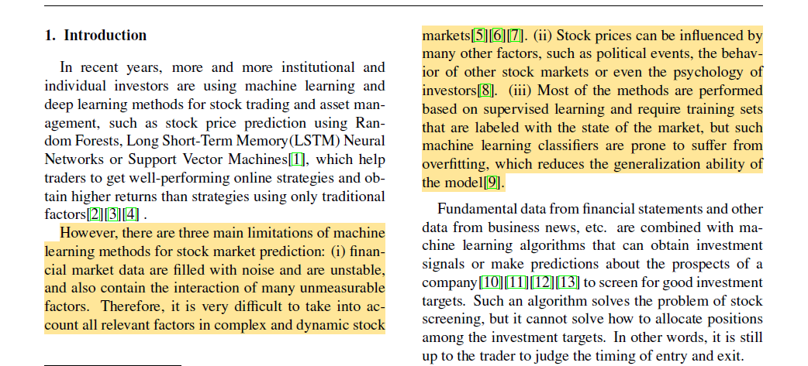

 

  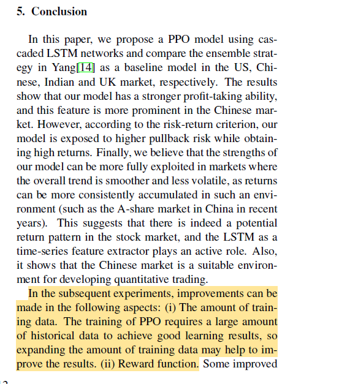         
  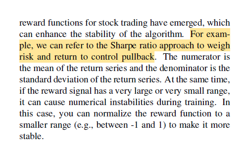     

   

---

>  **[Huang et al. 2024, p. 1 and p. 8](https://www.mdpi.com/2227-7390/12/24/4020)** 

*A Self-Rewarding Mechanism in Deep Reinforcement Learning for Trading Strategy Optimization*

**Huang et al. (2024)** investigate adaptive/self-rewarding mechanisms, showing that reward design can substantially affect trading performance and mitigate risk.

- Existing DRL trading systems mostly use static, manually designed reward functions, which do not adapt well to unstable and changing financial markets 

- The unresolved problem is how to build a **dynamic reward mechanism** that can adjust during learning and remain responsive to market changes 

- This paper addresses that gap by proposing a self-rewarding RL framework that combines expert labels with learned reward prediction 
         

  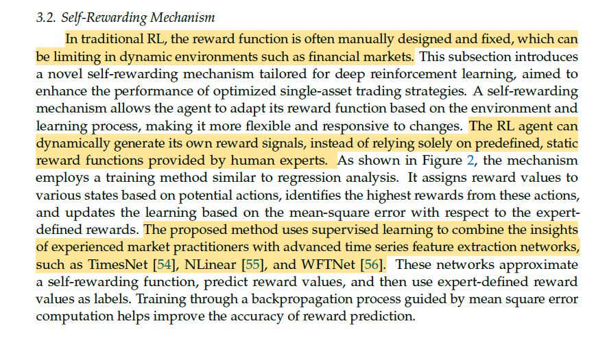         
  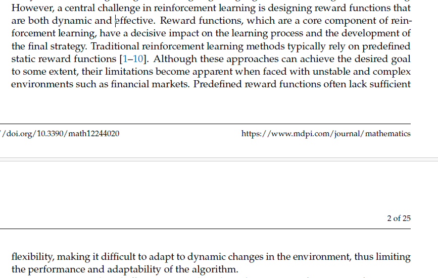     

 

  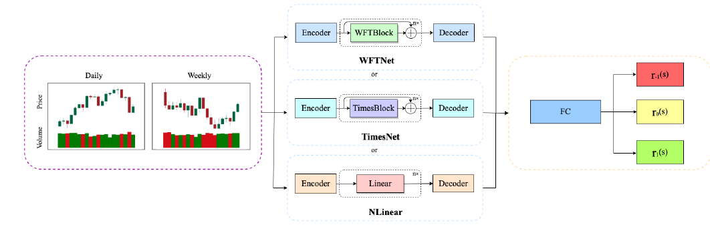

   

---

>  **[Millea 2021, p. 21, Section 12.1](https://www.mdpi.com/2306-5729/6/11/119)**

*Deep Reinforcement Learning for Trading—A Critical Survey*
                
Despite increasing interest in deep reinforcement learning for financial trading, the literature remains methodologically inconsistent and difficult to compare across studies. Existing works frequently use different datasets, different time periods, and different preprocessing techniques, which makes it difficult to determine whether reported performance differences are caused by the learning algorithm itself or by variation in the input data. In addition, only a limited number of studies examine model performance across multiple market types, leaving the generalizability of DRL-based trading systems insufficiently understood. Reproducibility is further weakened by the limited availability of source code and the incomplete reporting of implementation details such as hyperparameters and network architecture. Therefore, an important research gap remains in developing more standardized, comparable, and reproducible evaluation practices for DRL-based trading research
         

  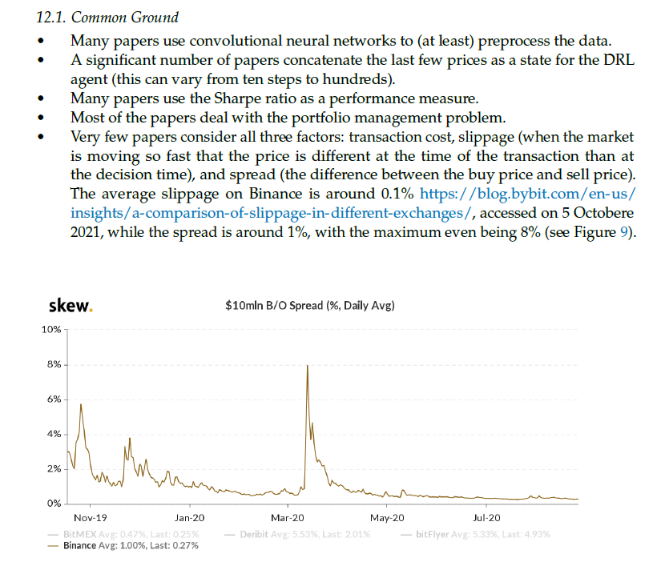

   

  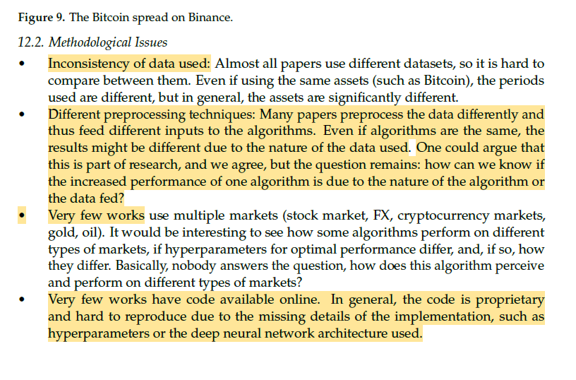

  

---

>  **[Liu et al. 2024, p. 3, 11, 27](https://link.springer.com/article/10.1007/s10994-023-06511-w)**

*Dynamic datasets and market environments for financial reinforcement learning*

Despite progress in financial reinforcement learning, existing studies still rely heavily on historical backtesting environments that may not represent real market conditions adequately. This creates a **simulation-to-reality** gap, where strong backtest results do not necessarily translate into robust live trading performance. The literature identifies several unresolved data-centric challenges, including **survivorship bias, low signal-to-noise ratio**, and **model overfitting**, which continue to limit the reliability and real-world deployment of FinRL agents  

  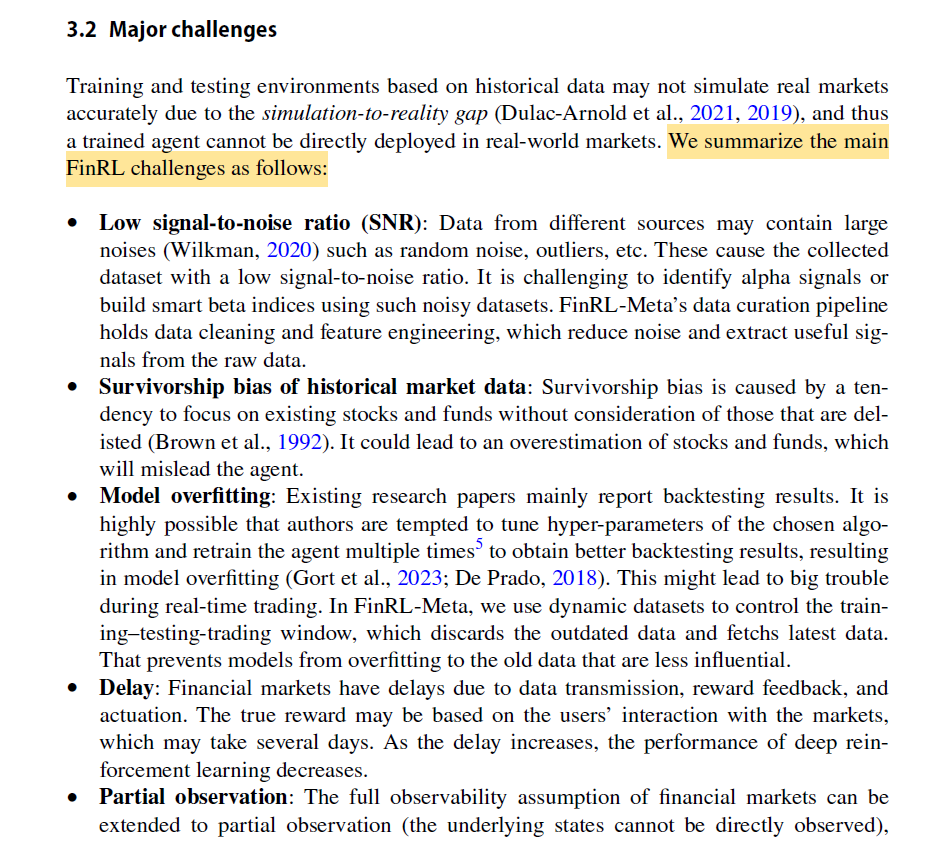
  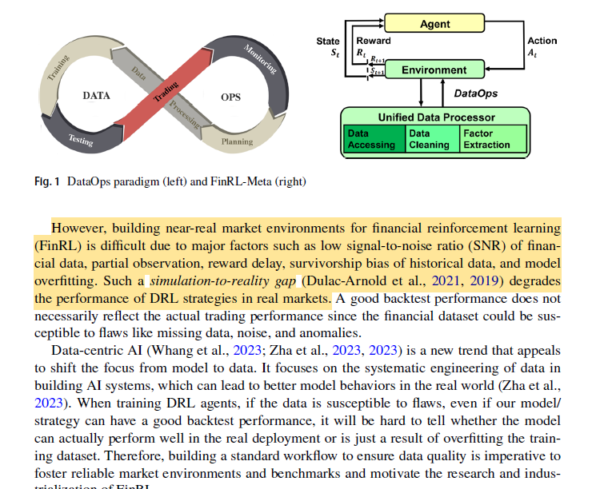

  

  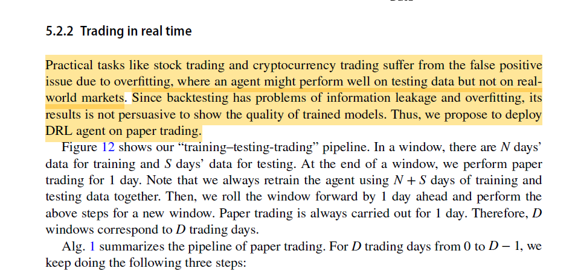

----

>  **[Wang & Liu (2025), Page 3 and Page 4, section 2.3](https://www.mdpi.com/1911-8074/18/7/347)** 

*Risk-Sensitive Deep Reinforcement Learning for Portfolio Optimization*

- Finally, **Wang & Liu (2025)** demonstrate the benefits of adaptive risk-sensitive policies under changing market conditions. They highlight that prior deep reinforcement learning research has focused predominantly on **equities and forex**, leaving commodity futures underexplored. Specifically, previous commodity-based DRL studies were limited in **adaptive agent-switching mechanisms or lacked portfolio-level optimization**, failing to fully address the distinctive structural volatility and supply-shock complexity of petroleum futures. 
- The paper also identifies a second, more practical gap: even its own proposed framework does not yet explicitly model roll mechanics, expiration effects, or liquidity constraints, which limits real-world deployment. 

       
         

  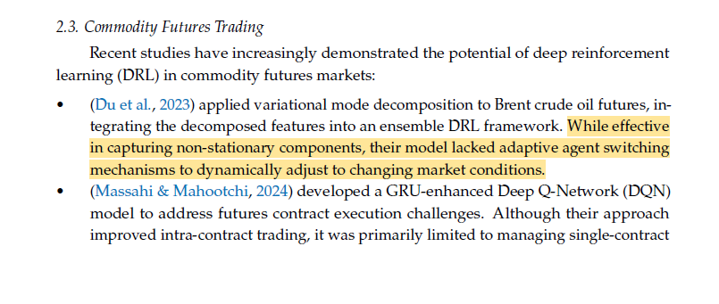

          
              

  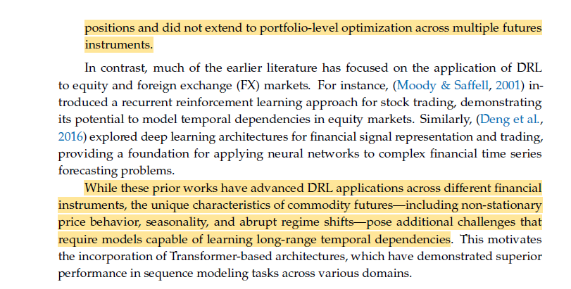  

          

---

### Combined Research Gap

Taken together, the reviewed studies address important but largely **separate aspects** of DRL-based financial trading:

- **Zou et al. (2023)** demonstrate the benefit of **LSTM-based temporal memory** for PPO trading by using historical sequences to capture temporal information. However, their framework mainly relies on **return-based rewards**, which do not directly account for risk measures such as variance or drawdown. 

- **Huang et al. (2024)** address the limitation of **static reward functions** by introducing a self-rewarding mechanism that combines expert labels with learned reward prediction. This shows the importance of reward design, but the approach **replaces the reward mechanism** rather than isolating the effect of a mathematically defined risk-adjusted reward such as the Differential Sharpe Ratio (DSR).

- **Millea (2021)** highlights the problem of **inconsistent experimental settings** in DRL trading research, where studies often use different datasets, time periods, preprocessing methods, friction assumptions, and evaluation procedures. This makes it difficult to determine whether performance improvements come from the algorithm or from differences in the experimental setup.

- **Liu et al. (2024)** address the need for more realistic and reproducible financial RL experiments through **dynamic datasets, realistic market environments, and rolling training-testing-trading evaluation**. However, their main contribution is focused on the **environment and evaluation pipeline**, rather than isolating the contribution of advanced risk-aware reward mechanisms.

- **Wang & Liu (2025)** demonstrate **adaptive risk-sensitive decision-making** under changing market conditions. However, their framework does not separately isolate the contributions of **temporal memory, reward shaping, and turnover control** within a single controlled ablation.

### Overall Gap

These studies therefore motivate three important directions:

**(1) temporal memory, (2) risk-aware reward design, and (3) turnover regularization.**

However, **among the studies reviewed for this project, we did not find a controlled experimental framework that isolates these mechanisms incrementally within the same PPO trading environment**. In particular, their separate contributions are not systematically decomposed under **identical data, cost assumptions, training conditions, and evaluation metrics**.

Therefore, this BTP-1 proposes a controlled four-stage ablation:

  
  
    PPO → LSTM-PPO → LSTM-PPO + DSR → LSTM-PPO + DSR + Turnover
  

to empirically quantify the incremental effect of each mechanism on **return, risk-adjusted performance, drawdown, turnover, and cost-adjusted trading stability**.

## 5. Literature Review

| Paper | Main Idea | Dataset/Market | State | Action | Reward | Key Finding | Limitation Relevant to BTP-1 |
| :--- | :--- | :--- | :--- | :--- | :--- | :--- | :--- |
| **Millea (2021)** | Survey of DRL in trading & market mechanics. | Crypto / Stocks / FX | Various (OHLCV, LOB) | Discrete & Cont. | Sharpe, PnL, Sortino | Identifies major inconsistencies in data, friction, and evaluation. | Meta-analysis; highlights the need for strict ablation & friction-control. |
| **Zou et al. (2023)** | Cascaded LSTM-PPO for automated trading. | US, CN, IN, UK Stocks | 181-dim (Prices, MACD, RSI, etc.) | Discrete (Shares) | Net Return | LSTM feature extractor outperforms ensemble & flat methods (TW=30, HS=512). | Relies on absolute profit reward; blind to variance/drawdown risk. |
| **Liu et al. (2024)** | DataOps pipeline and dynamic walk-forward environments. | Dow 30, S&P 500, Crypto | Balances, Prices, Tech Indicators | Continuous (Weights) | Asset value change | RLOps standardizes environments, reducing simulation-to-reality gap. | Standard baselines lack advanced online risk-aware reward functions. |
| **Huang et al. (2024)** | Self-rewarding mechanism blending expert labels. | DJI, IXIC, SP500, HSI | OHLCV | Discrete | Sharpe, Min-Max | Self-rewarding significantly beats fixed formulaic rewards. | Replaces rather than regularizes reward; relies on predefined expert labels. |
| **Wang & Liu (2025)** | ART-DRL: Adaptive risk-sensitive DRL. | Equities | Market/Tech Features | Continuous | Adaptive Risk | Dynamically shifts risk sensitivity based on market regime. | Focuses on adaptive risk sensitivity but does not isolate the independent contribution of temporal memory versus reward shaping in a controlled ablation. |

## 6. Common Trading Environment
To ensure strict comparability, all four models will be trained and evaluated in the exact same simulated environment:
*   **Data:** Daily OHLCV data for a defined universe of equities.
*   **Transaction Costs:** Fixed proportional commission fee.
*   **Slippage Assumptions:** Fixed slippage penalty applied per trade volume to simulate execution friction.
*   **Daily Rebalancing:** The agent acts once at the end of the daily close to adjust target holdings.
*   **Evaluation:** Dynamic walk-forward evaluation to prevent look-ahead bias and test temporal generalization.

**MDP / POMDP Formulation:**
Because financial markets are heavily influenced by unobservable latent factors, a standard MDP $(\mathcal{S}, \mathcal{A}, \mathcal{P}, \mathcal{R}, \gamma)$ is insufficient. The temporal information motivates a Partially Observable MDP (POMDP), formulated as $(\mathcal{O}, \mathcal{A}, \mathcal{P}, \mathcal{R}, \gamma)$, where the agent receives observations $o_t \in \mathcal{O}$ and utilizes an RNN (LSTM) to maintain a hidden belief state $h_t$ approximating the true market state.

## 7. State Representation
The observation vector $o_t$ provided to the agent strictly contains data available at decision time $t$ (no look-ahead bias). It is divided into:
1.  **Market Features:** Adjusted close prices and volumes (normalized).
2.  **Technical Indicators:** MACD, RSI, CCI, ADX.
3.  **Portfolio/Account Variables:** Current cash balance, current holdings (shares/weights), and total portfolio value.

## 8. Action Space
The action space $\mathcal{A}$ is a continuous vector $a_t \in [-1, 1]^N$ corresponding to the $N$ assets in the portfolio. 
*   **Definition:** Each scalar $a_{t,i}$ represents the target portfolio weight for asset $i$. 
*   **Constraint:** A Softmax or Dirichlet mapping will be applied post-network output to ensure $\sum_{i=1}^N w_{t,i} = 1$ and $w_{t,i} \ge 0$ (assuming a long-only constraint for equity basics).

## 9. Portfolio Dynamics and Cost Model
To prevent inconsistent gross-vs-net discrepancies and double-counting, the cost model is defined exactly once and applies to all four models.
*   **Total Portfolio Value ($V_t$):** $V_t = b_t + \sum_{i=1}^N h_{t,i} p_{t,i}$
*   **Transaction Cost ($C_t$):** Computed based on the change in weights: $C_t = c_{trans} \sum_{i=1}^N |w_{t,i} - w_{t-1,i}| \times V_t$
*   **Net Daily Return ($R_{net, t}$):** The true accounting return after all frictions:
    $$R_{net, t} = \frac{V_t - V_{t-1}}{V_{t-1}} - \frac{C_t}{V_{t-1}}$$
*   **Important:** $R_{net, t}$ represents the literal, measurable portfolio growth. It is the core input for all model reward functions.

## 10. Four-Model Ablation: Detailed Mathematical Modelling

### M1 — PPO Baseline
*   **Architecture:** Memoryless feed-forward Multi-Layer Perceptron (MLP) for both the actor $\pi_\theta(a_t|s_t)$ and critic $V_\phi(s_t)$ networks.
*   **State Input:** Only the current step observation $s_t$.
*   **Reward:** Direct net return, $r_t = R_{net, t}$ **(Liu et al. 2024, §3.1, p. 10)**.
*   **Objective:** Standard Generalized Advantage Estimation (GAE) where $Â_t = δ_t + (γλ)δ_{t+1}$ +...  and  $δ_t = r_t + γV_φ(s_{t+1}) - V_φ(s_t)$. The actor is updated using the clipped surrogate objective:

    $$L^{CLIP}(\theta) = \hat{\mathbb{E}}_t \left[ \min\left( \rho_t(\theta)\hat{A}_t, \text{clip}\left(\rho_t(\theta), 1-\epsilon, 1+\epsilon\right)\hat{A}_t \right) \right]$$

### M2 — LSTM-PPO (+ Temporal Memory)
*   **Mechanism Added:** Temporal memory (LSTM) to handle POMDP nature of financial data.
*   **Architecture:** Observation window $F_t = [s_{t-W+1}, \dots, s_t]$ is passed through an LSTM. The hidden state $h_t$ and cell state $c_t$ update recursively:

    $h_t, c_t = LSTM_{cell}(s_t, h_{t-1}, c_{t-1})$
       
*   **Conditioning:** The policy and value functions are now conditioned on the hidden representation: $\pi_\theta(a_t | h_t)$ and $V_\phi(h_t)$.
*   **Parameters:** Rather than arbitrary tuning, we strictly adopt the architecture validated by **Zou et al. (2023, §4.5.1 & §4.5.2, p. 9)**: Time Window ($W$) = 30, Hidden Size (HS) = 512.
*   **Reward:** Direct net return, $r_t = R_{net, t}$.

>  **[Zou et al. 2023](https://arxiv.org/pdf/2212.02721), "A Novel DRL Based Automated Stock Trading System...", p. 9**

  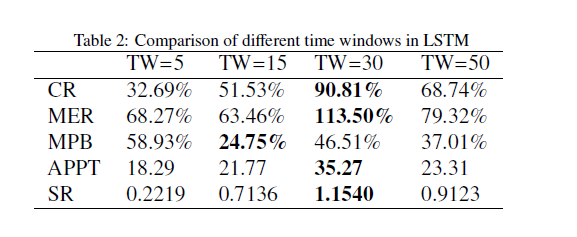
  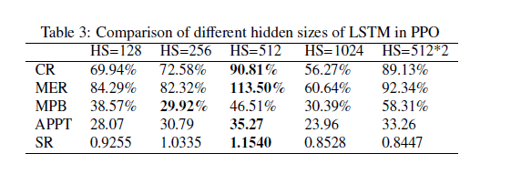

    

> *   **Purpose:** Justifies the direct adoption of the LSTM baseline variables without needing to re-tune from scratch.

### M3 — LSTM-PPO + DSR
*   **Mechanism Added:** Dense, risk-aware online reward. Standard profit rewards (M1 & M2) are blind to variance and drawdown risk. 
*   **Formulation:** Standard Sharpe requires a full episode to compute, causing sparse delayed rewards. Following **Millea (2021, §5.1.2, p. 8, Eq. 6 & 7)**, we use exponential moving estimates for the first moment ($A_t$) and second moment ($B_t$) of the net returns $R_{net, t}$:

    $$A_t = A_{t-1} + \eta (R_{net, t} - A_{t-1})$$

    $$B_t = B_{t-1} + \eta (R_{net, t}^2 - B_{t-1})$$

    Expanding the Sharpe ratio via a Taylor series yields the online DSR step-reward:

    $$D_t = \frac{B_{t-1}\Delta A_t - \frac{1}{2}A_{t-1}\Delta B_t}{(B_{t-1} - A_{t-1}^2 + \varepsilon)^{3/2}}$$
*   **Parameters:** $\eta \in (0,1]$ is the DSR moving-average adaptation rate, strictly distinct from the PPO discount factor $\gamma$. 
    **$\varepsilon$:** A small numerical-stability constant (e.g., $10^{-8}$) added to the DSR denominator to prevent instability when the estimated variance approaches zero.
*   **Reward:** $r_t = D_t$.

>  **[Millea 2021](https://www.mdpi.com/2306-5729/6/11/119), "Deep Reinforcement Learning for Trading—A Critical Survey", p. 8, Section 5.1.2**

  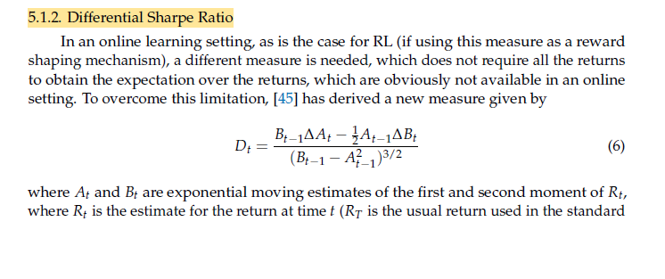
  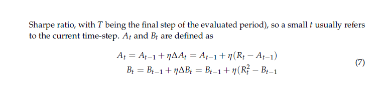

    
               
> *   **Purpose:** Establishes the exact mathematical foundation for the M3 risk-aware reward mechanism.
           
### M4 — LSTM-PPO + DSR + Turnover Regularization
*   **Mechanism Added:** Action-friction control to regularize churn.
*   **Formulation:** DSR mathematically incentivizes the agent to capture tiny, high-Sharpe anomalies, leading to high-frequency action oscillation ("churn"). In live markets, slippage destroys these theoretical returns. To strictly isolate friction-control from risk-sensitivity (M3 → M4 comparison), the turnover penalty must be additive. 

    $$r_t = D_t - \lambda_{turnover} \cdot \sum_{i=1}^N (a_{t,i} - a_{t-1,i})^2$$
    
*   **Note:** This penalty $\lambda_{turnover}$ only punishes the RL *reward signal* to discourage churning. The actual portfolio simulation already accounts for true transaction costs in $R_{net, t}$. Comparing M3 to M4 will explicitly test the hypothesis that regularizing action outputs stabilizes the LSTM memory mechanism.

## 11. Controlled Experimental Design

To isolate the incremental contribution of each mechanism, all models will be evaluated under the same experimental conditions:

- Identical daily datasets and feature sets.
- Identical walk-forward folds, so every model is exposed to the same market periods and regimes.
- Identical transaction-cost and slippage assumptions.
- Identical evaluation metrics and evaluation protocol.
- Comparable training budgets and multiple fixed random seeds across Python, NumPy, PyTorch, and the RL environment.

**Ablation Logic:**

- `M1 → M2` is intended to isolate the contribution of **temporal memory**.
- `M2 → M3` is intended to isolate the contribution of **DSR-based risk-aware reward shaping**.
- `M3 → M4` is intended to isolate the contribution of **turnover regularization**.

## 12. Walk-Forward Backtesting

Financial time series are non-stationary, and model performance can depend strongly on the market period used for training and testing. A single static train/test split provides only one out-of-sample period and may not adequately evaluate robustness across changing market conditions. Therefore, we will use a strict walk-forward evaluation methodology:

1. Train on window $T_0 \rightarrow T_k$.
2. Validate, if required for hyperparameter selection, on $T_k \rightarrow T_{k+m}$.
3. Test out-of-sample on $T_{k+m} \rightarrow T_{k+m+n}$.
4. Roll the entire window forward by $n$ days and repeat.

>  **[Liu et al. 2024](https://link.springer.com/article/10.1007/s10994-023-06511-w) "Dynamic datasets and market environments...", p. 13, Figure 5**

  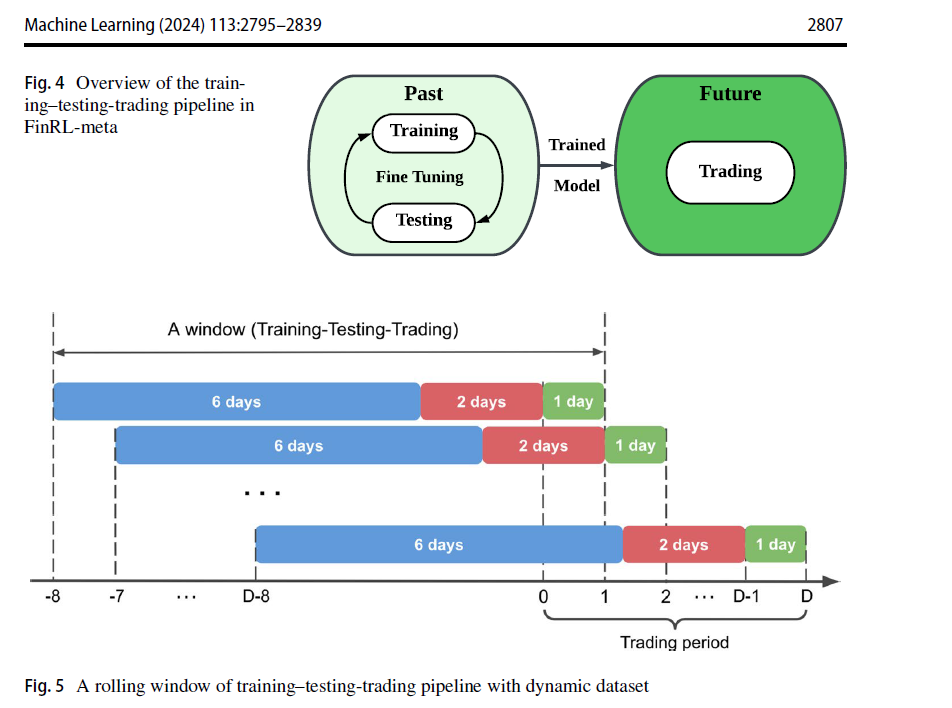  

 
     
> *   **Purpose:** Provides literature grounding for the strict walk-forward methodology preventing look-ahead bias.

## 13. Evaluation Metrics
The final out-of-sample arrays will be concatenated and evaluated using standard quantitative finance metrics to properly assess H2 and H3:
*   **Cumulative Return (CR):** $CR = \frac{P_{end} - P_0}{P_0}$
*   **Annualized Return (AR)**
*   **Sharpe Ratio (SR):** $SR = \frac{\mathbb{E}[R_P] - R_f}{\sigma_P}$
*   **Sortino Ratio**
*   **Maximum Drawdown (MDD):**  $MDD = \max_t\left(\frac{Peak_t - V_t}{Peak_t}\right)$

*   **Annualized Volatility**
*   **Cumulative Transaction Cost** 

Turnover and transaction cost are particularly important diagnostics for evaluating the effect of M4.

>  **[Huang et al. 2024](https://www.mdpi.com/2227-7390/12/24/4020) "A Self-Rewarding Mechanism...", p. 12, Section 4.2**

  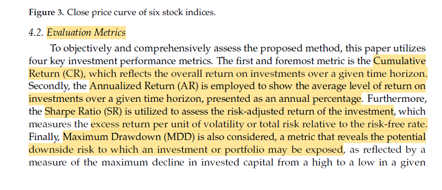   

 

> *   **Purpose:** Academic justification of the standard financial evaluation metrics.

## 14. Experimental Matrix

### Controlled Ablation Summary

| Model | Architecture | Reward | Memory | Turnover Regularization | Main Question |
| :--- | :--- | :--- | :--- | :--- | :--- |
| **M1** | PPO (MLP) | Net Return | None | None | Baseline performance without memory, risk shaping, or action regularization |
| **M2** | LSTM-PPO | Net Return | LSTM with window $W$ selected during validation | None | Does temporal memory improve robustness and adaptability? |
| **M3** | LSTM-PPO | DSR | LSTM | None | Does risk-aware reward shaping improve risk-adjusted performance? |
| **M4** | LSTM-PPO | DSR | LSTM | $\lambda_{\text{turn}}\sum_i(a_{t,i}-a_{t-1,i})^2$ | Does turnover regularization reduce churn and trading costs while preserving performance? |

**Execution Table:**

| Dataset | Train/Test Windows | Roll Window | Transaction Cost              | Seeds                | Metrics                                              |
| ------- | ------------------ | ----------- | ----------------------------- | -------------------- | ---------------------------------------------------- |
| [TODO]  | [TODO]             | [TODO]      | [TODO / literature-supported] | Multiple fixed seeds (e.g. 42, 100, 999 ~ *tentative*) | CR, AR, SR, Sortino, MDD, Volatility, Turnover, Cost |

## 15. Expected Analysis

The goal of this analysis is not simply "highest return wins."

* **H1:** If supported, M2 should demonstrate improved robustness across out-of-sample folds compared with M1, potentially with changes in volatility and drawdown.
* **H2:** If supported, M3 should demonstrate improved risk-adjusted performance over M2, such as a higher Sharpe/Sortino Ratio and/or lower Maximum Drawdown, even if its Cumulative Return is not higher.
* **H3:** If supported, M4 should exhibit lower **Average Turnover** and **Cumulative Transaction Costs** than M3 while maintaining or improving risk-adjusted out-of-sample performance.
* Fold-by-fold performance will be analyzed to assess whether the models remain robust during high-volatility and adverse market periods.

## 16. Failure Analysis

We will proactively investigate and report failure modes. If a model performs poorly or becomes unstable, the analysis will examine:

* **High Turnover / Churn:** Does the agent make frequent or excessively large allocation changes?
* **Regime Sensitivity:** Does the model perform well in certain market regimes but deteriorate substantially in others?
* **Reward Instability:** Does the DSR calculation become numerically unstable, leading to NaNs or unstable training?
* **Seed Sensitivity:** Does performance vary substantially across different random seeds?

*Note: The observed failure modes will be used as evidence to motivate and refine the direction of BTP-2.*

## 17. BTP-2 / MTP Future Direction
**BTP-2 will be guided by the failure modes identified in BTP-1**. Depending on the observed limitations of the final configuration, possible extensions include regime-aware or adaptive risk-sensitive DRL. More advanced extensions such as multi-agent or self-rewarding approaches will be considered in later MTP stages.

## 18. Final Summary
This project proposes a controlled empirical ablation study progressing from PPO to LSTM-PPO, DSR-based reward shaping, and turnover regularization. By maintaining consistent datasets, costs, training conditions, and walk-forward evaluation, the study aims to isolate the incremental contribution of temporal memory, risk-aware reward design, and turnover control. The resulting performance and failure analysis will provide an evidence-based basis for selecting the direction of BTP-2.
